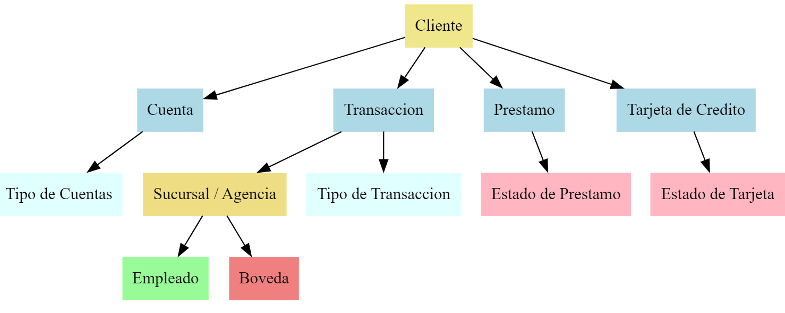
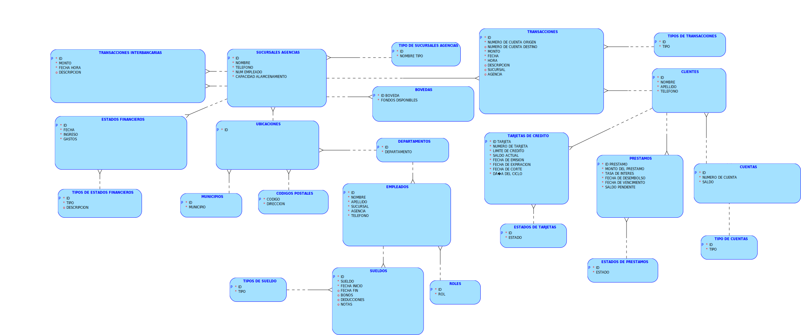
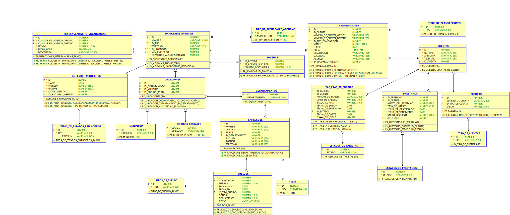
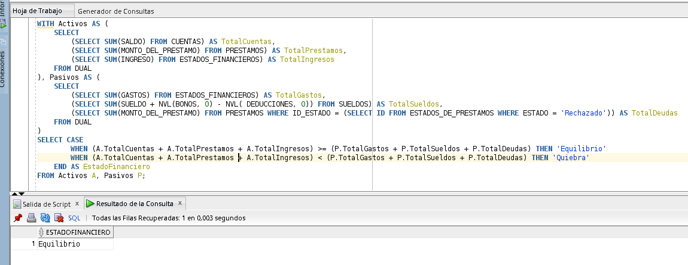
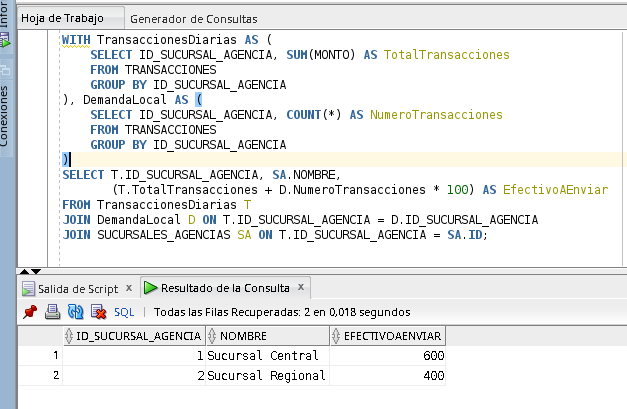
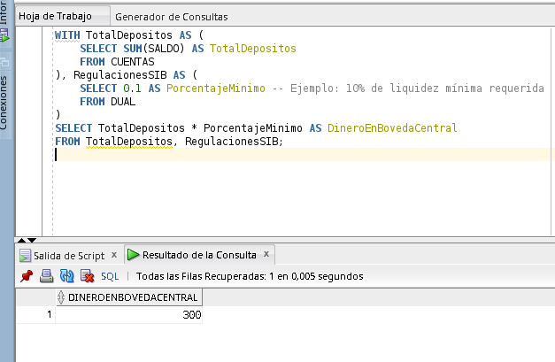

# Proyecto 2 Bases de Datos 1
<h1>Grupo 13</h1>

<div>
📕 SISTEMAS DE BASES DE DATOS 1
</div>
<br>
<div>
🙍‍♂️ Brandon Andy Jefferson Tejaxún Pichiyá 🆔 202112030
</div>
<div>
🙍‍♂️ Joab Israel Ajsivinac Ajsivinac 🆔 202200135
</div>
<div>
🙍‍♂️ Brayan Estiben Mica Perez 🆔 201907343
</div>
<div>
🙍‍♂️ Marcos Geovani Josías Pérez Secay 🆔 201903878
</div>
<br>
<div> 🏛 Universidad San Carlos de Guatemala</div>
<div> 📆 Segundo Semestre 2024</div>

### **Modelo Conceptual**

### Descripción de un Diagrama Conceptual

Un diagrama conceptual de una base de datos es una representación visual que muestra las entidades, sus atributos y las relaciones entre ellas. Este diagrama se utiliza para modelar la estructura lógica de la base de datos, proporcionando una visión clara y comprensible de cómo se organizan y conectan los datos.

### Componentes del Diagrama Conceptual

1. **Entidades**:
    - Representan objetos o conceptos del mundo real que son relevantes para el sistema.
    - Ejemplos: Sucursales/Agencias, Clientes, Empleados, Préstamos, Tarjetas de Crédito, Transacciones.
2. **Atributos**:
    - Son propiedades o características de las entidades.
    - Ejemplos: ID, Nombre, Tipo, Departamento, Municipio, Dirección, Código Postal, Teléfono, etc.
3. **Relaciones**:
    - Describen cómo las entidades están conectadas entre sí.
    - Ejemplos: Un cliente puede tener múltiples préstamos, un empleado trabaja en una sucursal, una transacción está asociada a un cliente y una sucursal.

### Diagrama Conceptual



### Descripción del Ejemplo

- **Clientes**: Entidad que representa a los clientes del sistema, quienes pueden tener cuentas bancarias, realizar transacciones, solicitar préstamos y obtener tarjetas de crédito.
- **Cuentas**: Entidad que representa las cuentas bancarias de los clientes, asociadas a un tipo de cuenta y con un saldo disponible.
- **Tipo de Cuentas**: Entidad que clasifica las cuentas bancarias de los clientes, como cuentas de ahorro o cuentas corrientes.
- **Transacciones**: Entidad que representa las operaciones financieras realizadas por los clientes, como depósitos, retiros o transferencias.
- **Tipo de Transacciones**: Entidad que clasifica las transacciones que pueden realizarse, como transferencias, pagos, depósitos o retiros.
- **Préstamos**: Entidad que representa los préstamos solicitados por los clientes, con información sobre el monto, la tasa de interés y el saldo pendiente.
- **Estados de Préstamos**: Entidad que define los posibles estados de los préstamos, como activo, pagado o en mora.
- **Tarjetas de Crédito**: Entidad que representa las tarjetas de crédito emitidas a los clientes, con información sobre el límite de crédito, el saldo actual y las fechas de emisión y expiración.
- **Estados de Tarjetas**: Entidad que define los posibles estados de las tarjetas de crédito, como activas, bloqueadas o vencidas.
- **Sucursales/Agencias**: Entidad que representa las sucursales o agencias donde se atienden a los clientes y se realizan las operaciones bancarias.
- **Bóvedas**: Entidad que registra los fondos disponibles en las bóvedas de las sucursales o agencias.
- **Empleados**: Entidad que representa a los empleados que trabajan en las sucursales o agencias, con su rol y departamento asociado.

### Beneficios del Diagrama Conceptual

- **Claridad**: Proporciona una visión clara y comprensible de las principales entidades del sistema y cómo están relacionadas entre sí.
- **Comunicación**: Facilita la comunicación entre los equipos de desarrollo, analistas y otros interesados al ofrecer un lenguaje visual común.
- **Planificación**: Permite planificar el diseño de la base de datos antes de su implementación física, asegurando que las relaciones estén bien definidas.
- **Normalización**: Ayuda a identificar posibles redundancias y dependencias, facilitando la normalización de las tablas para optimizar el diseño y evitar datos duplicados.

## Normalización

### Primera Forma Normal (1FN)

La **Primera Forma Normal** se trata de **eliminar grupos repetidos** en una tabla y asegurarnos de que **cada columna contenga valores atómicos** (es decir, no divididos o compuestos).

**Regla clave:**
Cada celda de una tabla debe contener **un solo valor**, y cada registro debe ser único.

**Ejemplo:**
Imagina que tienes una tabla de estudiantes con una columna llamada "Teléfonos" donde guardas varios números en una sola celda:

```
| Estudiante | Teléfonos        |
|------------|------------------|
| Juan       | 555-1234, 555-5678|

```

Este diseño **viola la 1FN**, porque tienes múltiples valores en una sola celda. Para cumplir con la 1FN, deberías separar esos valores en filas distintas:

```
| Estudiante | Teléfono  |
|------------|-----------|
| Juan       | 555-1234  |
| Juan       | 555-5678  |

```

### Segunda Forma Normal (2FN)

La **Segunda Forma Normal** se asegura de que una tabla esté en 1FN y que **todas las columnas dependan completamente de la clave primaria**.

**Regla clave:**
Si tienes una clave compuesta (más de una columna que sirve como clave primaria), cada columna no clave debe depender de **toda** la clave, no solo de una parte.

**Ejemplo:**
Supongamos que tienes una tabla con datos de un curso, que incluye los campos `Estudiante`, `Curso`, y `NombreCurso`. La clave primaria aquí sería una combinación de `Estudiante` y `Curso`:

```
| Estudiante | Curso | NombreCurso |
|------------|-------|-------------|
| Juan       | 101   | Historia    |
| Juan       | 102   | Matemáticas |

```

El campo `NombreCurso` depende solo del `Curso`, no del `Estudiante`. Por lo tanto, para cumplir con la 2FN, deberías separar los datos en dos tablas, una para la relación entre estudiantes y cursos y otra para los detalles del curso:

1. Tabla de **EstudianteCurso**:

```
| Estudiante | Curso |
|------------|-------|
| Juan       | 101   |
| Juan       | 102   |

```

1. Tabla de **Curso**:

```
| Curso | NombreCurso |
|-------|-------------|
| 101   | Historia    |
| 102   | Matemáticas |

```

### Tercera Forma Normal (3FN)

La **Tercera Forma Normal** implica que la tabla esté en 2FN y que **ninguna columna no clave dependa de otra columna no clave**.

**Regla clave:**
Cada columna no clave debe depender **solo** de la clave primaria y no de otras columnas no claves.

**Ejemplo:**
Digamos que tienes una tabla de empleados:

```
| IDEmpleado | NombreEmpleado | Departamento | JefeDepartamento |
|------------|----------------|--------------|------------------|
| 1          | Ana            | Ventas       | Laura            |
| 2          | Luis           | Ventas       | Laura            |

```

Aquí, `JefeDepartamento` depende de `Departamento`, no del `IDEmpleado`, lo que viola la 3FN. Para cumplirla, deberías mover `JefeDepartamento` a una tabla separada:

1. Tabla de **Empleado**:

```
| IDEmpleado | NombreEmpleado | Departamento |
|------------|----------------|--------------|
| 1          | Ana            | Ventas       |
| 2          | Luis           | Ventas       |

```

1. Tabla de **Departamento**:

```
| Departamento | JefeDepartamento |
|--------------|------------------|
| Ventas       | Laura            |

```

Al aplicar las formas normales, estamos estructurando mejor la base de datos, reduciendo la redundancia y evitando problemas de actualización o inconsistencias.

# Tablas Iniciales del Proyecto

## Clientes

| ID | Nombre | Apellido | Número de Cuenta | Tipo de Cuenta | Saldo | Teléfono |
| --- | --- | --- | --- | --- | --- | --- |
| 1 | Nombre_1 | Apellido_1 | 70186741-1 | Ahorro | 256848.49 | +502 4634-7041 |
| 2 | Nombre_2 | Apellido_2 | 42148275-2 | Ahorro | 378588.21 | +502 2701-1140 |
| 3 | Nombre_3 | Apellido_3 | 95968205-3 | Depósito Monetario | 294799.84 | +502 6277-2079 |
| 4 | Nombre_4 | Apellido_4 | 74601803-4 | Ahorro | 30357.74 | +502 7371-9552 |
| 5 | Nombre_5 | Apellido_5 | 18184518-5 | Ahorro | 270027.6 | +502 1699-8122 |

## Agencias_Sucursales

| ID | Nombre | Tipo | Departamento | Municipio | Dirección | Código Postal | Teléfono |
| --- | --- | --- | --- | --- | --- | --- | --- |
| 1 | Sucursal Antigua Guatemala 1 | Sucursal | Sacatepéquez | Antigua Guatemala | Zona 7 | 91405 | +502 8036-8423 |
| 2 | Sucursal Escuintla 2 | Sucursal | Escuintla | Escuintla | Zona 1 | 97145 | +502 9525-7114 |
| 3 | Sucursal Quetzaltenango 3 | Sucursal | Quetzaltenango | Quetzaltenango | Zona 1 | 53915 | +502 2873-4763 |
| 4 | Sucursal Cobán 4 | Sucursal | Alta Verapaz | Cobán | Zona 8 | 31535 | +502 6809-5562 |
| 5 | Sucursal Flores 5 | Sucursal | Petén | Flores | Zona 10 | 63389 | +502 5942-1959 |

## Tarjetas_de_crédito

| ID Tarjeta | ID Cliente | Número de Tarjeta | Límite de Crédito | Saldo Actual | Fecha de Emisión | Fecha de Expiración | Estado | Fecha de Corte | Día del Ciclo |
| --- | --- | --- | --- | --- | --- | --- | --- | --- | --- |
| 1 | 558120 | 4872410269895827 | 4344.96 | 20358.67 | 2022-02-09 | 2025-05-04 | Bloqueada | 2022-03-06 | 6 |
| 2 | 443984 | 4,78043E+15 | 48263.8 | 12583.92 | 2021-04-29 | 2025-11-10 | Activa | 2021-05-26 | 26 |
| 3 | 709855 | 4653562424107275 | 37894.69 | 16274.3 | 2021-12-10 | 2026-08-08 | Bloqueada | 2022-01-08 | 8 |
| 4 | 495584 | 4935123661880312 | 3610.3 | 31113.15 | 2020-11-21 | 2025-07-26 | Bloqueada | 2020-12-18 | 18 |
| 5 | 621646 | 4,91859E+15 | 35118.01 | 5054.92 | 2023-10-06 | 2028-02-05 | Cancelada | 2023-11-05 | 5 |

## Prestamos

| ID Préstamo | ID Cliente | Monto del Préstamo | Tasa de Interés | Fecha de Desembolso | Fecha de Vencimiento | Saldo Pendiente | Estado del Préstamo |
| --- | --- | --- | --- | --- | --- | --- | --- |
| 1 | 495798 | 964203.64 | 6.63 | 2023-11-19 | 2032-06-06 | 674174.18 | Vencido |
| 2 | 42734 | 811935.67 | 13.42 | 2023-05-07 | 2028-08-29 | 756664.53 | Activo |
| 3 | 540710 | 961457.89 | 13.68 | 2021-10-28 | 2030-03-10 | 200162.19 | Vencido |
| 4 | 983331 | 78869.24 | 11.42 | 2023-05-14 | 2026-12-17 | 67546.61 | Vencido |
| 5 | 409214 | 456168.05 | 6.93 | 2020-05-18 | 2026-07-08 | 729762.37 | Activo |

# Empleado

| ID | Nombre | Apellido | Rol | Departamento | Sucursal/Asignación | Teléfono |
| --- | --- | --- | --- | --- | --- | --- |
| 1 | Nombre_1 | Apellido_1 | Auditor Interno | Petén | Sucursal/Agencia 528 | +502 7815-2167 |
| 2 | Nombre_2 | Apellido_2 | Administrador | Chiquimula | Sucursal/Agencia 171 | +502 3808-9764 |
| 3 | Nombre_3 | Apellido_3 | Atención al Cliente | Jutiapa | Sucursal/Agencia 103 | +502 4899-1699 |
| 4 | Nombre_4 | Apellido_4 | Oficial de Crédito | Quetzaltenango | Sucursal/Agencia 36 | +502 3452-1726 |
| 5 | Nombre_5 | Apellido_5 | Soporte Técnico | Jutiapa | Sucursal/Agencia 583 | +502 8283-6524 |

## Transacciones

| ID Transacción | ID Cliente | Número de Cuenta | Tipo de Transacción | Monto | Fecha | Hora | Descripción | Sucursal/Agencia |
| --- | --- | --- | --- | --- | --- | --- | --- | --- |
| 1 | 455902 | 58639163-455902 | Transferencia | 2865.8 | 2023-10-24 | 14:28:01 | Transacción de tipo Transferencia | Sucursal/Agencia 221 |
| 2 | 469824 | 99757988-469824 | Depósito | 2438.92 | 2023-12-09 | 14:28:01 | Transacción de tipo Depósito | Sucursal/Agencia 257 |
| 3 | 626567 | 19969005-626567 | Transferencia | 9494.98 | 2024-06-01 | 14:28:01 | Transacción de tipo Transferencia | Sucursal/Agencia 874 |
| 4 | 784443 | 95861936-784443 | Pago | 8399.08 | 2023-12-26 | 14:28:01 | Transacción de tipo Pago | Sucursal/Agencia 265 |
| 5 | 421423 | 21672609-421423 | Depósito | 7722.1 | 2022-12-27 | 14:28:01 | Transacción de tipo Depósito | Sucursal/Agencia 986 |

## Bovedas

| ID_BOVEDA | ID_AGENCIA_SUCURSAL | FONDOS_DISPONIBLES |
| --- | --- | --- |
| 1 | 101 | 100000.00 |
| 2 | 102 | 150000.50 |
| 3 | 103 | 200000.75 |
| 4 | 104 | 250000.00 |
| 5 | 105 | 300000.25 |

## Transacciones_Interbancarias

| ID | ID_SUCURSAL_AGENCIA_ORIGEN | ID_SUCURSAL_AGENCIA_DESTINO | MONTO | FECHA_HORA | DESCRIPCION |
| --- | --- | --- | --- | --- | --- |
| 1 | 101 | 201 | 5000.00 | 2023-01-01 12:00:00 | Transferencia 1 |
| 2 | 102 | 202 | 7500.50 | 2023-02-01 13:00:00 | Transferencia 2 |
| 3 | 103 | 203 | 10000.75 | 2023-03-01 14:00:00 | Transferencia 3 |
| 4 | 104 | 204 | 12500.00 | 2023-04-01 15:00:00 | Transferencia 4 |
| 5 | 105 | 205 | 15000.25 | 2023-05-01 16:00:00 | Transferencia 5 |

## Estado_Financiero

| ID | FECHA | INGRESOS | GASTOS | ESTADO | DESCRIPCION | ID_SUCURSAL_AGENCIA |
| --- | --- | --- | --- | --- | --- | --- |
| 1 | 2023-01-01 | 10000.00 | 5000.00 | Solvente | Estado financiero 1 | 101 |
| 2 | 2023-02-01 | 15000.50 | 7500.50 | Equilibrio | Estado financiero 2 | 102 |
| 3 | 2023-03-01 | 20000.75 | 10000.75 | Quiebra | Estado financiero 3 | 103 |
| 4 | 2023-04-01 | 25000.00 | 12500.00 | Solvente | Estado financiero 4 | 104 |
| 5 | 2023-05-01 | 30000.25 | 15000.25 | Equilibrio | Estado financiero 5 | 105 |

# **Aplicación de las 3 formas normales**

## Clientes

| ID | Nombre | Apellido | Número de Cuenta | Tipo_de_Cuenta | Saldo | Teléfono |
| --- | --- | --- | --- | --- | --- | --- |
| 1 | Nombre_1 | Apellido_1 | 70186741-1 | Ahorro | 256848.49 | +502 4634-7041 |
| 2 | Nombre_2 | Apellido_2 | 42148275-2 | Ahorro | 378588.21 | +502 2701-1140 |
| 3 | Nombre_3 | Apellido_3 | 95968205-3 | Depósito Monetario | 294799.84 | +502 6277-2079 |
| 4 | Nombre_4 | Apellido_4 | 74601803-4 | Ahorro | 30357.74 | +502 7371-9552 |
| 5 | Nombre_5 | Apellido_5 | 18184518-5 | Ahorro | 270027.6 | +502 1699-8122 |

**No cumple con la segunda forma normal los campos Número de cuenta, tipo de cuenta, saldo.**

### 1. Clientes

| ID | Nombre | Apellido | Teléfono | Id_cuenta |
| --- | --- | --- | --- | --- |
| 1 | Nombre_1 | Apellido_1 | +502 4634-7041 | 1 |
| 2 | Nombre_2 | Apellido_2 | +502 2701-1140 | 2 |
| 3 | Nombre_3 | Apellido_3 | +502 6277-2079 | 3 |
| 4 | Nombre_4 | Apellido_4 | +502 7371-9552 | 4 |
| 5 | Nombre_5 | Apellido_5 | +502 1699-8122 | 5 |

### 2. Cuentas

| ID | Número_de_Cuenta | ID_Tipo_de_Cuenta | Saldo |
| --- | --- | --- | --- |
| 1 | 70186741-1 | 1 | 256848.49 |
| 2 | 42148275-2 | 1 | 378588.21 |
| 3 | 95968205-3 | 2 | 294799.84 |
| 4 | 74601803-4 | 1 | 30357.74 |
| 5 | 18184518-5 | 1 | 270027.6 |

Tipo de cuenta no cumple con la tercera forma normal.

### 3. Tipo_de_cuentas

| ID | Tipo |
| --- | --- |
| 1 | Ahorro |
| 2 | Deposito Monetario |

## Sucursales_Agencias

| ID | Nombre | Tipo | Departamento | Municipio | Dirección | Código_Postal | Teléfono |
| --- | --- | --- | --- | --- | --- | --- | --- |
| 1 | Sucursal Antigua Guatemala 1 | Sucursal | Sacatepéquez | Antigua Guatemala | Zona 7 | 91405 | +502 8036-8423 |
| 2 | Agencia Escuintla 2 | Agencia | Escuintla | Escuintla | Zona 1 | 97145 | +502 9525-7114 |
| 3 | Sucursal Quetzaltenango 3 | Sucursal | Quetzaltenango | Quetzaltenango | Zona 1 | 53915 | +502 2873-4763 |
| 4 | Sucursal Cobán 74 | Sucursal | Alta Verapaz | Cobán | Zona 8 | 31535 | +502 6809-5562 |
| 5 | Agencia Flores 5 | Agencia | Petén | Flores | Zona 10 | 63389 | +502 5942-1959 |

**No cumple con la segunda forma normal Departamento, Municipio, Dirección, Código postal.**

### 4. Sucursales_Agencias

| ID | Nombre | ID_Tipo | Teléfono | ID_Ubicación |
| --- | --- | --- | --- | --- |
| 1 | Sucursal Antigua Guatemala 1 | Sucursal | +502 8036-8423 | 1 |
| 2 | Sucursal Escuintla 2 | Agencia | +502 9525-7114 | 2 |
| 3 | Sucursal Quetzaltenango 3 | Sucursal | +502 2873-4763 | 3 |
| 4 | Sucursal Cobán 4 | Sucursal | +502 6809-5562 | 4 |
| 5 | Sucursal Flores 5 | Agencia | +502 5942-1959 | 5 |
1. **Tipo_de_Sucursales**

| ID | nombre_tipo |
| --- | --- |
| 1 | Sucursal |
| 2 | Agencia |

### 6. Ubicaciones

| ID | Id_Departamento | Id_Municipio | Id_Código_Postal |
| --- | --- | --- | --- |
| 1 | 1 | 1 | 1 |
| 2 | 2 | 2 | 2 |
| 3 | 3 | 3 | 3 |
| 4 | 4 | 4 | 4 |
| 5 | 5 | 5 | 5 |

Para la tabla Ubicación se aplica la 3F a los atributos Departamento, Municipio y Codigo Postal

Dirección por 2F sera parte de la tabla código_Postal 

1. **Departamentos**

| ID | Departamento |
| --- | --- |
| 1 | Sacatepéquez |
| 2 | Escuintla |
| 3 | Quetzaltenango |
| 4 | Alta Verapaz |
| 5 | Petén |
1. **Municipios**

| ID | Municipio |
| --- | --- |
| 1 | Antigua Guatemala |
| 2 | Escuintla |
| 3 | Quetzaltenango |
| 4 | Cobán |
| 5 | Flores |
1. **Codigos_Postales**

| ID | Código | Dirección |
| --- | --- | --- |
| 1 | 91405 | Zona 7 |
| 2 | 97145 | Zona 1 |
| 3 | 53915 | Zona 1 |
| 4 | 31535 | Zona 8 |
| 5 | 63389 | Zona 10 |

## Tarjetas de crédito

| ID_Tarjeta | ID_Cliente | Número_de_Tarjeta | Límite_de_Crédito | Saldo_Actual | Fecha_de_Emisión | Fecha_de_Expiración | Estado | Fecha_de_Corte | Día_del_Ciclo |
| --- | --- | --- | --- | --- | --- | --- | --- | --- | --- |
| 1 | 558120 | 4872410269895827 | 4344.96 | 20358.67 | 2022-02-09 | 2025-05-04 | Bloqueada | 2022-03-06 | 6 |
| 2 | 443984 | 4,78043E+15 | 48263.8 | 12583.92 | 2021-04-29 | 2025-11-10 | Activa | 2021-05-26 | 26 |
| 3 | 709855 | 4653562424107275 | 37894.69 | 16274.3 | 2021-12-10 | 2026-08-08 | Bloqueada | 2022-01-08 | 8 |
| 4 | 495584 | 4935123661880312 | 3610.3 | 31113.15 | 2020-11-21 | 2025-07-26 | Bloqueada | 2020-12-18 | 18 |
| 5 | 621646 | 4,91859E+15 | 35118.01 | 5054.92 | 2023-10-06 | 2028-02-05 | Cancelada | 2023-11-05 | 5 |

**Los estados de la tarjeta de crédito no cumple con la segunda forma normal**

### 10. Tarjetas_de_crédito

| ID_Tarjeta | ID_Cliente | Número_de_Tarjeta | Límite_de_Crédito | Saldo_Actual | Fecha_de_Emisión | Fecha_de_Expiración | ID_Estado_de_Targeta | Fecha_de_Corte | Día_del_Ciclo |
| --- | --- | --- | --- | --- | --- | --- | --- | --- | --- |
| 1 | 558120 | 4872410269895827 | 4344.96 | 20358.67 | 2022-02-09 | 2025-05-04 | 3 | 2022-03-06 | 6 |
| 2 | 443984 | 4,78043E+15 | 48263.8 | 12583.92 | 2021-04-29 | 2025-11-10 | 1 | 2021-05-26 | 26 |
| 3 | 709855 | 4653562424107275 | 37894.69 | 16274.3 | 2021-12-10 | 2026-08-08 | 3 | 2022-01-08 | 8 |
| 4 | 495584 | 4935123661880312 | 3610.3 | 31113.15 | 2020-11-21 | 2025-07-26 | 3 | 2020-12-18 | 18 |
| 5 | 621646 | 4,91859E+15 | 35118.01 | 5054.92 | 2023-10-06 | 2028-02-05 | 2 | 2023-11-05 | 5 |

### 11. Estados_de_Tarjetas

| ID | Estado |
| --- | --- |
| 1 | Activa |
| 2 | Cancelada |
| 3 | Bloqueada |

## Prestamos

| ID_Préstamo | ID_Cliente | Monto_del_Préstamo | Tasa_de_Interés | Fecha_de_Desembolso | Fecha_de_Vencimiento | Saldo_Pendiente | Estado_del_Préstamo |
| --- | --- | --- | --- | --- | --- | --- | --- |
| 1 | 495798 | 964203.64 | 6.63 | 2023-11-19 | 2032-06-06 | 674174.18 | Vencido |
| 2 | 42734 | 811935.67 | 13.42 | 2023-05-07 | 2028-08-29 | 756664.53 | Activo |
| 3 | 540710 | 961457.89 | 13.68 | 2021-10-28 | 2030-03-10 | 200162.19 | Vencido |
| 4 | 983331 | 78869.24 | 11.42 | 2023-05-14 | 2026-12-17 | 67546.61 | Vencido |
| 5 | 409214 | 456168.05 | 6.93 | 2020-05-18 | 2026-07-08 | 729762.37 | Activo |

**Los estado del préstamo no cumplen con la segunda forma**

### 12. Prestamos

| ID_Préstamo | ID_Cliente | Monto_del_Préstamo | Tasa_de_Interés | Fecha_de_Desembolso | Fecha_de_Vencimiento | Saldo_Pendiente | ID_Estado_de_Prestamo |
| --- | --- | --- | --- | --- | --- | --- | --- |
| 1 | 495798 | 964203.64 | 6.63 | 2023-11-19 | 2032-06-06 | 674174.18 | 1 |
| 2 | 42734 | 811935.67 | 13.42 | 2023-05-07 | 2028-08-29 | 756664.53 | 1 |
| 3 | 540710 | 961457.89 | 13.68 | 2021-10-28 | 2030-03-10 | 200162.19 | 2 |
| 4 | 983331 | 78869.24 | 11.42 | 2023-05-14 | 2026-12-17 | 67546.61 | 1 |
| 5 | 409214 | 456168.05 | 6.93 | 2020-05-18 | 2026-07-08 | 729762.37 | 3 |

### 13. Estados_de_prestamos

| ID | Estado |
| --- | --- |
| 1 | Activo |
| 2 | Vencido |
| 3 | Cancelado |

# Empleados

| ID | Nombre | Apellido | Rol | Departamento | Sucursal/Asignacion | Teléfono |
| --- | --- | --- | --- | --- | --- | --- |
| 1 | Nombre_1 | Apellido_1 | Auditor Interno | Petén | Sucursal/Agencia 528 | +502 7815-2167 |
| 2 | Nombre_2 | Apellido_2 | Administrador | Chiquimula | Sucursal/Agencia 171 | +502 3808-9764 |
| 3 | Nombre_3 | Apellido_3 | Atención al Cliente | Jutiapa | Sucursal/Agencia 103 | +502 4899-1699 |
| 4 | Nombre_4 | Apellido_4 | Oficial de Crédito | Quetzaltenango | Sucursal/Agencia 36 | +502 3452-1726 |
| 5 | Nombre_5 | Apellido_5 | Soporte Técnico | Jutiapa | Sucursal/Agencia 583 | +502 8283-6524 |

**La columna Sucursal/Agencia no cumple con la primera forma normal**

**La columna Rol no cumple con la segundo forma**

**La columna departamento ya existe**

### 14. Empleados

| ID | Nombre | Apellido | Id_Rol | ID_Departamento | Sucursal | Agencia | Teléfono |
| --- | --- | --- | --- | --- | --- | --- | --- |
| 1 | Nombre_1 | Apellido_1 | 1 | 1 | Sucursal | Agencia 528 | +502 7815-2167 |
| 2 | Nombre_2 | Apellido_2 | 2 | 3 | Sucursal | Agencia 171 | +502 3808-9764 |
| 3 | Nombre_3 | Apellido_3 | 3 | 4 | Sucursal | Agencia 103 | +502 4899-1699 |
| 4 | Nombre_4 | Apellido_4 | 4 | 1 | Sucursal | Agencia 36 | +502 3452-1726 |
| 5 | Nombre_5 | Apellido_5 | 5 | 2 | Sucursal | Agencia 583 | +502 8283-6524 |

### 15. Roles

| ID | Rol |
| --- | --- |
| 1 | Auditor Interno |
| 2 | Administrador |
| 3 | Atención al Cliente |
| 4 | Oficial de Crédito |
| 5 | Soporte Técnico |

## Transacciones

| ID Transacción | ID Cliente | Número de Cuenta Origen | Número de Cuenta Destino | Tipo de Transacción | Monto | Fecha | Hora | Descripción | Sucursal/Agencia | ID_Sucursal/Agencia |
| --- | --- | --- | --- | --- | --- | --- | --- | --- | --- | --- |
| 1 | 455902 | 58639163 | 455902 | Transferencia | 2865.8 | 2023-10-24 | 14:28:01 | Transacción de tipo Transferencia | Sucursal/Agencia 221 | 1 |
| 2 | 469824 | 99757988 | 469824 | Depósito | 2438.92 | 2023-12-09 | 14:28:01 | Transacción de tipo Depósito | Sucursal/Agencia 257 | 2 |
| 3 | 626567 | 19969005 | 626567 | Transferencia | 9494.98 | 2024-06-01 | 14:28:01 | Transacción de tipo Transferencia | Sucursal/Agencia 874 | 3 |
| 4 | 784443 | 95861936 | 784443 | Pago | 8399.08 | 2023-12-26 | 14:28:01 | Transacción de tipo Pago | Sucursal/Agencia 265 | 4 |
| 5 | 421423 | 21672609 | 21672609 | Depósito | 7722.1 | 2022-12-27 | 14:28:01 | Transacción de tipo Depósito | Sucursal/Agencia 986 | 5 |

Sucursal/Agencia no cumple con 1F

Tipo de transacción no cumple con 2F

1. **Transacciones**

| ID Transacción | ID Cliente | Número de Cuenta Origen | Número de Cuenta Destino | id_Transaccion | Monto | Fecha | Hora | Descripción | Sucursal | Agencia | ID_Sucursal/Agencia |
| --- | --- | --- | --- | --- | --- | --- | --- | --- | --- | --- | --- |
| 1 | 455902 | 58639163 | 455902 | 1 | 2865.8 | 2023-10-24 | 14:28:01 | Transacción de tipo Transferencia | Sucursal/ | Agencia 221 | 1 |
| 2 | 469824 | 99757988 | 469824 | 2 | 2438.92 | 2023-12-09 | 14:28:01 | Transacción de tipo Depósito | Sucursal/ | Agencia 257 | 2 |
| 3 | 626567 | 19969005 | 626567 | 1 | 9494.98 | 2024-06-01 | 14:28:01 | Transacción de tipo Transferencia | Sucursal/ | Agencia 874 | 3 |
| 4 | 784443 | 95861936 | 784443 | 3 | 8399.08 | 2023-12-26 | 14:28:01 | Transacción de tipo Pago | Sucursal/ | Agencia 265 | 4 |
| 5 | 421423 | 21672609 | 21672609 | 2 | 7722.1 | 2022-12-27 | 14:28:01 | Transacción de tipo Depósito | Sucursal/ | Agencia 986 | 5 |

### 17. Tipos_de_Transacciones

| ID  | Tipo |
| --- | --- |
| 1 | Transferencia |
| 2 | Depósito |
| 3 | Pago |

## 18. Bovedas

| ID_BOVEDA | ID_AGENCIA_SUCURSAL | FONDOS_DISPONIBLES |
| --- | --- | --- |
| 1 | 101 | 100000.00 |
| 2 | 102 | 150000.50 |
| 3 | 103 | 200000.75 |
| 4 | 104 | 250000.00 |
| 5 | 105 | 300000.25 |

## 19. Transacciones_Interbancarias

| ID | ID_SUCURSAL_AGENCIA_ORIGEN | ID_SUCURSAL_AGENCIA_DESTINO | MONTO | FECHA_HORA | DESCRIPCION |
| --- | --- | --- | --- | --- | --- |
| 1 | 101 | 201 | 5000.00 | 2023-01-01 12:00:00 | Transferencia 1 |
| 2 | 102 | 202 | 7500.50 | 2023-02-01 13:00:00 | Transferencia 2 |
| 3 | 103 | 203 | 10000.75 | 2023-03-01 14:00:00 | Transferencia 3 |
| 4 | 104 | 204 | 12500.00 | 2023-04-01 15:00:00 | Transferencia 4 |
| 5 | 105 | 205 | 15000.25 | 2023-05-01 16:00:00 | Transferencia 5 |

## 20. Estados_Financieros

| ID | FECHA | INGRESOS | GASTOS | ID_Tipos_de_Estados | DESCRIPCION | ID_SUCURSAL_AGENCIA |
| --- | --- | --- | --- | --- | --- | --- |
| 1 | 2023-01-01 | 10000.00 | 5000.00 | 1 | Estado financiero 1 | 101 |
| 2 | 2023-02-01 | 15000.50 | 7500.50 | 2 | Estado financiero 2 | 102 |
| 3 | 2023-03-01 | 20000.75 | 10000.75 | 3 | Estado financiero 3 | 103 |
| 4 | 2023-04-01 | 25000.00 | 12500.00 | 1 | Estado financiero 4 | 104 |
| 5 | 2023-05-01 | 30000.25 | 15000.25 | 1 | Estado financiero 5 | 105 |

## 21. Tipos_de_Estados

| ID | ESTADO |
| --- | --- |
| 1 | Solvente |
| 2 | Equilibrio |
| 3 | Quiebra |

## 22. SUELDOS

| ID | ID_EMPLEADO | SUELDO | FECHA_INICIO | FECHA_FIN | ID_TIPO_SUELDO | BONOS | DEDUCCIONES | NOTAS |
| --- | --- | --- | --- | --- | --- | --- | --- | --- |
| 1 | 1 | 3000.00 | 2023-01-01 | 2023-12-31 | 1 | 500.00 | 100.00 | Empleado con buen desempeño |
| 2 | 2 | 3200.00 | 2023-02-01 | 2023-12-31 | 2 | 600.00 | 150.00 | Empleado con desempeño excelente |
| 3 | 3 | 2800.00 | 2023-03-01 | 2023-12-31 | 3 | 400.00 | 120.00 | Empleado con desempeño satisfactorio |
| 4 | 4 | 3500.00 | 2023-04-01 | 2023-12-31 | 1 | 700.00 | 200.00 | Empleado con desempeño sobresaliente |
| 5 | 5 | 3100.00 | 2023-05-01 | 2023-12-31 | 2 | 550.00 | 130.00 | Empleado con desempeño bueno |

## 23. TIPOS_DE_SUELDOS

| ID | TIPO |
| --- | --- |
| 1 | Mensual |
| 2 | Quincenal |
| 3 | Semanal |
| 4 | Diario |
| 5 | Bimestral |

# Tablas Obtenidas

1. DEPARTAMENTOS

---

2. MUNICIPIOS

---

3. CODIGOS_POSTALES

---

4. ROLES

---

5. TIPO_DE_SUCURSALES_AGENCIAS

---

6. TIPO_DE_CUENTAS

---

7. ESTADOS_DE_TARJETAS

---

8. ESTADOS_DE_PRESTAMOS

---

9. TIPOS_DE_TRANSACCIONES

---

10. UBICACIONES

---

11. EMPLEADOS

---

12. SUCURSALES_AGENCIAS

---

13. CUENTAS

---

14. CLIENTES

---

15. BOVEDAS

---

16. TARJETAS_DE_CREDITO

---

17. PRESTAMOS

---

18. TRANSACCIONES

---

19. TRANSACCIONES_INTERBANCARIAS

---

20. ESTADOS_FINANCIEROS

---

21. TIPOS_DE_ESTADOS_FINANCIEROS

---

22. SUELDOS

---

1. TIPOS_DE_SUELDOS

---

# **Diagramas Matriciales**

Identificando relaciones a través de la matriz

---

| departamentos | municipios | codigos_postales | roles | tipo_de_sucursales_agencias | tipo_de_cuentas | estados_de_tarjetas | estados_de_prestamos | ubicaciones | cuentas | clientes | sucursales_agencias | bovedas | tarjetas_de_credito | prestamos | empleados | transacciones | transacciones_interbancarias | estados_financieros | sueldos |
| --- | --- | --- | --- | --- | --- | --- | --- | --- | --- | --- | --- | --- | --- | --- | --- | --- | --- | --- | --- |
| departamentos | - |  |  |  |  |  |  |  | 1:N |  |  |  |  |  |  | 1:N |  |  |  |
| municipios |  | - |  |  |  |  |  |  | 1:N |  |  |  |  |  |  |  |  |  |  |
| codigos_postales |  |  | - |  |  |  |  |  | 1:N |  |  |  |  |  |  |  |  |  |  |
| roles |  |  |  | - |  |  |  |  |  |  |  |  |  |  |  |  |  |  |  |
| tipo_de_sucursales_agencias |  |  |  |  | - |  |  |  |  |  |  | 1:N |  |  |  |  |  |  |  |
| tipo_de_cuentas |  |  |  |  |  | - |  |  |  | 1:N |  |  |  |  |  |  |  |  |  |
| estados_de_tarjetas |  |  |  |  |  |  | - |  |  |  |  |  |  | 1:N |  |  |  |  |  |
| estados_de_prestamos |  |  |  |  |  |  |  | - |  |  |  |  |  |  | 1:N |  |  |  |  |
| ubicaciones | N:1 | N:1 | N:1 |  |  |  |  |  | - |  |  |  |  |  |  |  |  |  |  |
| cuentas |  |  |  |  |  | N:1 |  |  |  | - | 1:N |  |  |  |  |  |  |  |  |
| clientes |  |  |  |  |  |  | N:1 |  |  | N:1 | - | 1:N |  | 1:N | 1:N |  |  |  |  |
| sucursales_agencias |  |  |  |  | N:1 |  |  |  | N:1 |  |  | - | N:1 |  |  |  |  | 1:N | 1:N |
| bovedas |  |  |  |  |  |  |  |  |  |  |  | N:1 | - |  |  |  |  |  |  |
| tarjetas_de_credito |  |  |  |  |  |  | N:1 |  |  | N:1 |  |  |  | - |  |  |  |  |  |
| prestamos |  |  |  |  |  |  |  | N:1 |  | N:1 |  |  |  |  | - |  |  |  |  |
| empleados | N:1 |  |  |  |  |  |  |  |  |  |  |  |  |  |  | - |  |  |  |
| transacciones |  |  |  |  |  |  |  |  |  | N:1 | N:1 |  |  |  |  |  | - |  |  |
| transacciones_interbancarias |  |  |  |  |  |  |  |  |  |  |  | N:1 |  |  |  |  |  | - |  |
| estados_financieros |  |  |  |  |  |  |  |  |  |  |  | N:1 |  |  |  |  |  |  | - |
| sueldos |  |  |  |  |  |  |  |  |  |  |  |  |  |  |  | N:1 |  |  |  |

# Modelo Lógico



# Modelo Físico (Relacional)



# Documentación de la Consulta SQL Oracle

# Consulta # 1:
## ¿Está el banco en quiebra o en punto de equilibrio?

### Explicación

1. **Definición de Activos:**
    - Se crea una `CTE (Common Table Expression)` llamada `Activos` que calcula tres valores:
        - `TotalCuentas`: La suma de los saldos de todas las cuentas.
        - `TotalPrestamos`: La suma de los montos de todos los préstamos otorgados a los clientes.
        - `TotalIngresos`: La suma de los ingresos registrados en los estados financieros.

    ```sql
    WITH Activos AS (
        SELECT 
            (SELECT SUM(SALDO) FROM CUENTAS) AS TotalCuentas,
            (SELECT SUM(MONTO_DEL_PRESTAMO) FROM PRESTAMOS) AS TotalPrestamos,
            (SELECT SUM(INGRESO) FROM ESTADOS_FINANCIEROS) AS TotalIngresos
        FROM DUAL
    )
    ```

2. **Definición de Pasivos:**
    - Se crea otra `CTE` llamada `Pasivos` que calcula tres valores:
        - `TotalGastos`: La suma de todos los gastos registrados en los estados financieros.
        - `TotalSueldos`: La suma de todos los sueldos, bonos (si los hay) y deducciones (si las hay) de los empleados.
        - `TotalDeudas`: La suma de los montos de los préstamos que han sido rechazados, considerados como deudas incobrables.

    ```sql
    Pasivos AS (
        SELECT 
            (SELECT SUM(GASTOS) FROM ESTADOS_FINANCIEROS) AS TotalGastos,
            (SELECT SUM(SUELDO + NVL(BONOS, 0) - NVL( DEDUCCIONES, 0)) FROM SUELDOS) AS TotalSueldos,
            (SELECT SUM(MONTO_DEL_PRESTAMO) FROM PRESTAMOS WHERE ID_ESTADO = (SELECT ID FROM ESTADOS_DE_PRESTAMOS WHERE ESTADO = 'Rechazado')) AS TotalDeudas
        FROM DUAL
    )
    ```

3. **Determinación del Estado Financiero:**
    - Finalmente, se compara la suma de los activos (`TotalCuentas + TotalPrestamos + TotalIngresos`) con la suma de los pasivos (`TotalGastos + TotalSueldos + TotalDeudas`).
    - Dependiendo del resultado, se determina si el banco está en `Equilibrio` o en `Quiebra`.

    ```sql
    SELECT CASE
            WHEN (A.TotalCuentas + A.TotalPrestamos + A.TotalIngresos) >= (P.TotalGastos + P.TotalSueldos + P.TotalDeudas) THEN 'Equilibrio'
            WHEN (A.TotalCuentas + A.TotalPrestamos + A.TotalIngresos) < (P.TotalGastos + P.TotalSueldos + P.TotalDeudas) THEN 'Quiebra'
        END AS EstadoFinanciero
    FROM Activos A, Pasivos P;
    ```

### Resultados
El resultado de esta consulta será un único valor: `Equilibrio` o `Quiebra`, que representa el estado financiero actual del banco.




---

# Consulta # 2:

## ¿Cuánto dinero debe enviarse a cada sucursal o agencia?

### Explicación de la consulta

1. **TransaccionesDiarias:**
    - Se crea una CTE llamada `TransaccionesDiarias` que calcula el total de transacciones monetarias (`TotalTransacciones`) realizadas en cada sucursal/agencia (`ID_SUCURSAL_AGENCIA`), tomando en cuenta todas las fechas.

    ```sql
    WITH TransaccionesDiarias AS (
        SELECT ID_SUCURSAL_AGENCIA, SUM(MONTO) AS TotalTransacciones
        FROM TRANSACCIONES
        GROUP BY ID_SUCURSAL_AGENCIA
    )
    ```

2. **DemandaLocal:**
    - Se crea otra CTE llamada `DemandaLocal` que calcula el número de transacciones (`NumeroTransacciones`) realizadas en cada sucursal/agencia, tomando en cuenta todas las fechas.

    ```sql
    DemandaLocal AS (
        SELECT ID_SUCURSAL_AGENCIA, COUNT(*) AS NumeroTransacciones
        FROM TRANSACCIONES
        GROUP BY ID_SUCURSAL_AGENCIA
    )
    ```

3. **Determinación del efectivo a enviar:**
    - Finalmente, se unen las CTE `TransaccionesDiarias` y `DemandaLocal` para calcular cuánto efectivo debe enviarse a cada sucursal/agencia (`EfectivoAEnviar`).
    - Además, se une la tabla `SUCURSALES_AGENCIAS` para obtener el nombre de la sucursal o agencia (`SA.NOMBRE`).

    ```sql
    SELECT T.ID_SUCURSAL_AGENCIA, SA.NOMBRE,
           (T.TotalTransacciones + D.NumeroTransacciones * 100) AS EfectivoAEnviar
    FROM TransaccionesDiarias T
    JOIN DemandaLocal D ON T.ID_SUCURSAL_AGENCIA = D.ID_SUCURSAL_AGENCIA
    JOIN SUCURSALES_AGENCIAS SA ON T.ID_SUCURSAL_AGENCIA = SA.ID;
    ```

### Resultados
El resultado de esta consulta será el ID y el nombre de cada sucursal o agencia junto con la cantidad de efectivo que debe enviarse a cada una.



---

# Consulta # 3:

## ¿Cuánto dinero debe almacenarse en la bóveda central?

### Explicación de la consulta

1. **TotalDepositos:**
    - Se crea una CTE llamada `TotalDepositos` que calcula la suma de los saldos (`SALDO`) de todas las cuentas en la tabla `CUENTAS`.

    ```sql
    WITH TotalDepositos AS (
        SELECT SUM(SALDO) AS TotalDepositos
        FROM CUENTAS
    )
    ```

2. **RegulacionesSIB:**
    - Se crea otra CTE llamada `RegulacionesSIB` que define el porcentaje mínimo de liquidez requerido por la SIB. En este ejemplo, el porcentaje mínimo es del 10% (0.1).

    ```sql
    RegulacionesSIB AS (
        SELECT 0.1 AS PorcentajeMinimo -- Ejemplo: 10% de liquidez mínima requerida
        FROM DUAL
    )
    ```

3. **Cálculo del dinero en la bóveda central:**
    - Finalmente, se multiplica el total de depósitos (`TotalDepositos`) por el porcentaje mínimo de liquidez (`PorcentajeMinimo`) para determinar cuánto dinero debe mantenerse en la bóveda central (`DineroEnBovedaCentral`).

    ```sql
    SELECT TotalDepositos * PorcentajeMinimo AS DineroEnBovedaCentral
    FROM TotalDepositos, RegulacionesSIB;
    ```

### Resultados
El resultado de esta consulta será el monto de dinero que debe permanecer en la bóveda central del banco para cumplir con las regulaciones de la SIB sobre el porcentaje mínimo de liquidez.


---
