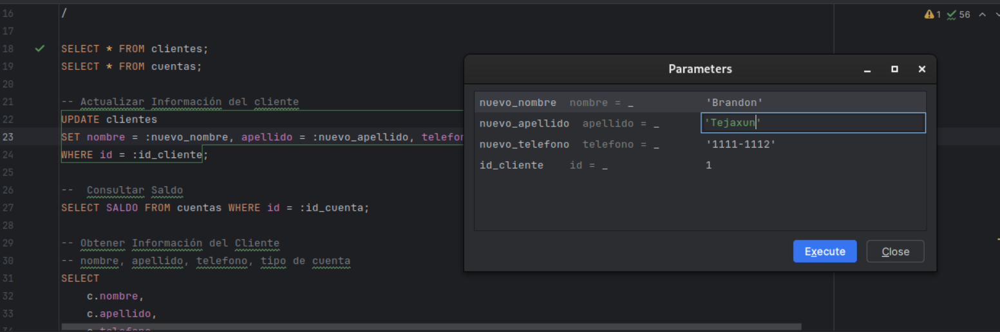
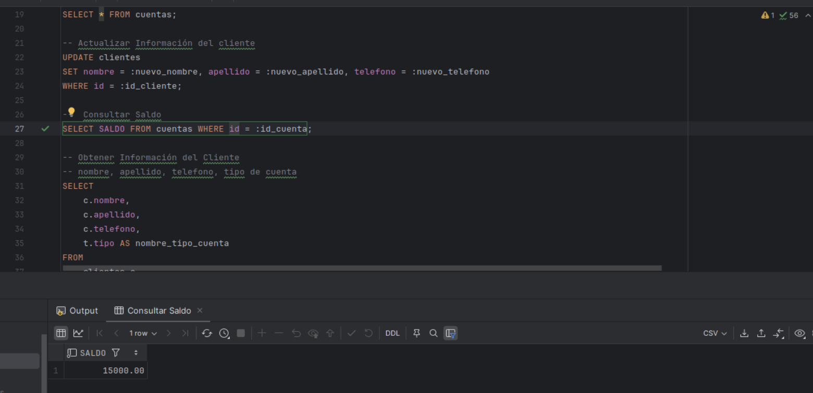
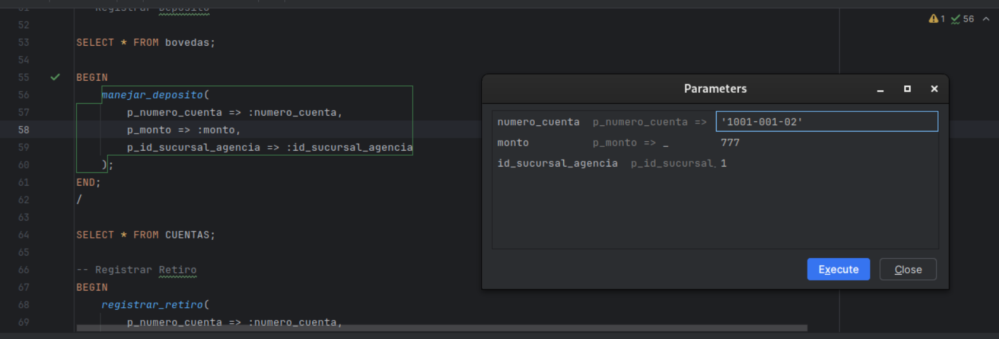
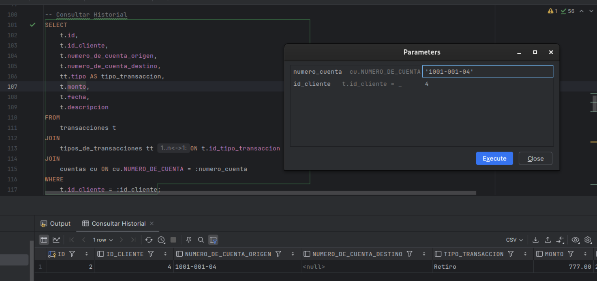
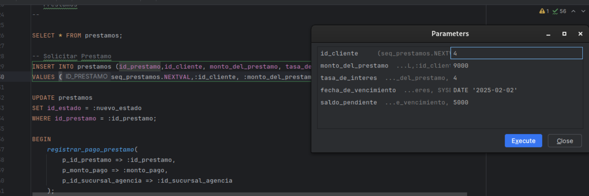
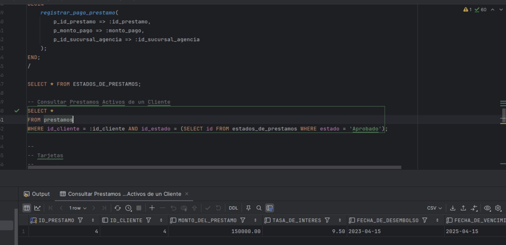
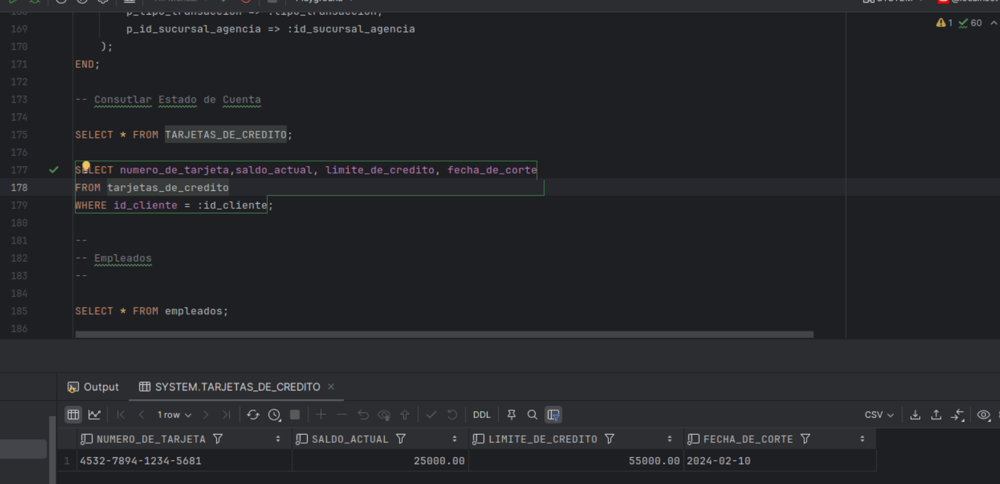
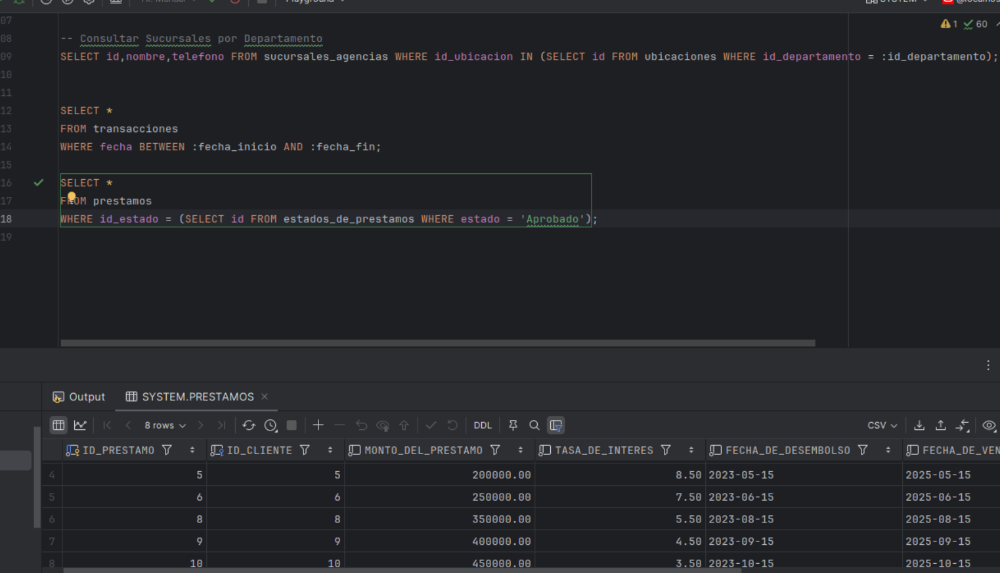

# Proyecto 2 Bases de Datos 1
<h1>Grupo 13</h1>

<div>
📕 SISTEMAS DE BASES DE DATOS 1
</div>
<br>
<div>
🙍‍♂️ Brandon Andy Jefferson Tejaxún Pichiyá 🆔 202112030
</div>
<div>
🙍‍♂️ Joab Israel Ajsivinac Ajsivinac 🆔 202200135
</div>
<div>
🙍‍♂️ Brayan Estiben Mica Perez 🆔 201907343
</div>
<div>
🙍‍♂️ Marcos Geovani Josías Pérez Secay 🆔 201903878
</div>
<br>
<div> 🏛 Universidad San Carlos de Guatemala</div>
<div> 📆 Segundo Semestre 2024</div>

### **Modelo Conceptual**

### Descripción de un Diagrama Conceptual

Un diagrama conceptual de una base de datos es una representación visual que muestra las entidades, sus atributos y las relaciones entre ellas. Este diagrama se utiliza para modelar la estructura lógica de la base de datos, proporcionando una visión clara y comprensible de cómo se organizan y conectan los datos.

### Componentes del Diagrama Conceptual

1. **Entidades**:
    - Representan objetos o conceptos del mundo real que son relevantes para el sistema.
    - Ejemplos: Sucursales/Agencias, Clientes, Empleados, Préstamos, Tarjetas de Crédito, Transacciones.
2. **Atributos**:
    - Son propiedades o características de las entidades.
    - Ejemplos: ID, Nombre, Tipo, Departamento, Municipio, Dirección, Código Postal, Teléfono, etc.
3. **Relaciones**:
    - Describen cómo las entidades están conectadas entre sí.
    - Ejemplos: Un cliente puede tener múltiples préstamos, un empleado trabaja en una sucursal, una transacción está asociada a un cliente y una sucursal.

### Diagrama Conceptual


### Descripción del Ejemplo

- **Clientes**: Entidad que representa a los clientes del sistema, quienes pueden tener cuentas bancarias, realizar transacciones, solicitar préstamos y obtener tarjetas de crédito.
- **Cuentas**: Entidad que representa las cuentas bancarias de los clientes, asociadas a un tipo de cuenta y con un saldo disponible.
- **Tipo de Cuentas**: Entidad que clasifica las cuentas bancarias de los clientes, como cuentas de ahorro o cuentas corrientes.
- **Transacciones**: Entidad que representa las operaciones financieras realizadas por los clientes, como depósitos, retiros o transferencias.
- **Tipo de Transacciones**: Entidad que clasifica las transacciones que pueden realizarse, como transferencias, pagos, depósitos o retiros.
- **Préstamos**: Entidad que representa los préstamos solicitados por los clientes, con información sobre el monto, la tasa de interés y el saldo pendiente.
- **Estados de Préstamos**: Entidad que define los posibles estados de los préstamos, como activo, pagado o en mora.
- **Tarjetas de Crédito**: Entidad que representa las tarjetas de crédito emitidas a los clientes, con información sobre el límite de crédito, el saldo actual y las fechas de emisión y expiración.
- **Estados de Tarjetas**: Entidad que define los posibles estados de las tarjetas de crédito, como activas, bloqueadas o vencidas.
- **Sucursales/Agencias**: Entidad que representa las sucursales o agencias donde se atienden a los clientes y se realizan las operaciones bancarias.
- **Bóvedas**: Entidad que registra los fondos disponibles en las bóvedas de las sucursales o agencias.
- **Empleados**: Entidad que representa a los empleados que trabajan en las sucursales o agencias, con su rol y departamento asociado.

### Beneficios del Diagrama Conceptual

- **Claridad**: Proporciona una visión clara y comprensible de las principales entidades del sistema y cómo están relacionadas entre sí.
- **Comunicación**: Facilita la comunicación entre los equipos de desarrollo, analistas y otros interesados al ofrecer un lenguaje visual común.
- **Planificación**: Permite planificar el diseño de la base de datos antes de su implementación física, asegurando que las relaciones estén bien definidas.
- **Normalización**: Ayuda a identificar posibles redundancias y dependencias, facilitando la normalización de las tablas para optimizar el diseño y evitar datos duplicados.

## Normalización

### Primera Forma Normal (1FN)

La **Primera Forma Normal** se trata de **eliminar grupos repetidos** en una tabla y asegurarnos de que **cada columna contenga valores atómicos** (es decir, no divididos o compuestos).

**Regla clave:**
Cada celda de una tabla debe contener **un solo valor**, y cada registro debe ser único.

**Ejemplo:**
Imagina que tienes una tabla de estudiantes con una columna llamada "Teléfonos" donde guardas varios números en una sola celda:

```
| Estudiante | Teléfonos        |
|------------|------------------|
| Juan       | 555-1234, 555-5678|

```

Este diseño **viola la 1FN**, porque tienes múltiples valores en una sola celda. Para cumplir con la 1FN, deberías separar esos valores en filas distintas:

```
| Estudiante | Teléfono  |
|------------|-----------|
| Juan       | 555-1234  |
| Juan       | 555-5678  |

```

### Segunda Forma Normal (2FN)

La **Segunda Forma Normal** se asegura de que una tabla esté en 1FN y que **todas las columnas dependan completamente de la clave primaria**.

**Regla clave:**
Si tienes una clave compuesta (más de una columna que sirve como clave primaria), cada columna no clave debe depender de **toda** la clave, no solo de una parte.

**Ejemplo:**
Supongamos que tienes una tabla con datos de un curso, que incluye los campos `Estudiante`, `Curso`, y `NombreCurso`. La clave primaria aquí sería una combinación de `Estudiante` y `Curso`:

```
| Estudiante | Curso | NombreCurso |
|------------|-------|-------------|
| Juan       | 101   | Historia    |
| Juan       | 102   | Matemáticas |

```

El campo `NombreCurso` depende solo del `Curso`, no del `Estudiante`. Por lo tanto, para cumplir con la 2FN, deberías separar los datos en dos tablas, una para la relación entre estudiantes y cursos y otra para los detalles del curso:

1. Tabla de **EstudianteCurso**:

```
| Estudiante | Curso |
|------------|-------|
| Juan       | 101   |
| Juan       | 102   |

```

1. Tabla de **Curso**:

```
| Curso | NombreCurso |
|-------|-------------|
| 101   | Historia    |
| 102   | Matemáticas |

```

### Tercera Forma Normal (3FN)

La **Tercera Forma Normal** implica que la tabla esté en 2FN y que **ninguna columna no clave dependa de otra columna no clave**.

**Regla clave:**
Cada columna no clave debe depender **solo** de la clave primaria y no de otras columnas no claves.

**Ejemplo:**
Digamos que tienes una tabla de empleados:

```
| IDEmpleado | NombreEmpleado | Departamento | JefeDepartamento |
|------------|----------------|--------------|------------------|
| 1          | Ana            | Ventas       | Laura            |
| 2          | Luis           | Ventas       | Laura            |

```

Aquí, `JefeDepartamento` depende de `Departamento`, no del `IDEmpleado`, lo que viola la 3FN. Para cumplirla, deberías mover `JefeDepartamento` a una tabla separada:

1. Tabla de **Empleado**:

```
| IDEmpleado | NombreEmpleado | Departamento |
|------------|----------------|--------------|
| 1          | Ana            | Ventas       |
| 2          | Luis           | Ventas       |

```

1. Tabla de **Departamento**:

```
| Departamento | JefeDepartamento |
|--------------|------------------|
| Ventas       | Laura            |

```

Al aplicar las formas normales, estamos estructurando mejor la base de datos, reduciendo la redundancia y evitando problemas de actualización o inconsistencias.

# Tablas Iniciales del Proyecto

## Clientes

| ID | Nombre | Apellido | Número de Cuenta | Tipo de Cuenta | Saldo | Teléfono |
| --- | --- | --- | --- | --- | --- | --- |
| 1 | Nombre_1 | Apellido_1 | 70186741-1 | Ahorro | 256848.49 | +502 4634-7041 |
| 2 | Nombre_2 | Apellido_2 | 42148275-2 | Ahorro | 378588.21 | +502 2701-1140 |
| 3 | Nombre_3 | Apellido_3 | 95968205-3 | Depósito Monetario | 294799.84 | +502 6277-2079 |
| 4 | Nombre_4 | Apellido_4 | 74601803-4 | Ahorro | 30357.74 | +502 7371-9552 |
| 5 | Nombre_5 | Apellido_5 | 18184518-5 | Ahorro | 270027.6 | +502 1699-8122 |

## Agencias_Sucursales

| ID | Nombre | Tipo | Departamento | Municipio | Dirección | Código Postal | Teléfono |
| --- | --- | --- | --- | --- | --- | --- | --- |
| 1 | Sucursal Antigua Guatemala 1 | Sucursal | Sacatepéquez | Antigua Guatemala | Zona 7 | 91405 | +502 8036-8423 |
| 2 | Sucursal Escuintla 2 | Sucursal | Escuintla | Escuintla | Zona 1 | 97145 | +502 9525-7114 |
| 3 | Sucursal Quetzaltenango 3 | Sucursal | Quetzaltenango | Quetzaltenango | Zona 1 | 53915 | +502 2873-4763 |
| 4 | Sucursal Cobán 4 | Sucursal | Alta Verapaz | Cobán | Zona 8 | 31535 | +502 6809-5562 |
| 5 | Sucursal Flores 5 | Sucursal | Petén | Flores | Zona 10 | 63389 | +502 5942-1959 |

## Tarjetas_de_crédito

| ID Tarjeta | ID Cliente | Número de Tarjeta | Límite de Crédito | Saldo Actual | Fecha de Emisión | Fecha de Expiración | Estado | Fecha de Corte | Día del Ciclo |
| --- | --- | --- | --- | --- | --- | --- | --- | --- | --- |
| 1 | 558120 | 4872410269895827 | 4344.96 | 20358.67 | 2022-02-09 | 2025-05-04 | Bloqueada | 2022-03-06 | 6 |
| 2 | 443984 | 4,78043E+15 | 48263.8 | 12583.92 | 2021-04-29 | 2025-11-10 | Activa | 2021-05-26 | 26 |
| 3 | 709855 | 4653562424107275 | 37894.69 | 16274.3 | 2021-12-10 | 2026-08-08 | Bloqueada | 2022-01-08 | 8 |
| 4 | 495584 | 4935123661880312 | 3610.3 | 31113.15 | 2020-11-21 | 2025-07-26 | Bloqueada | 2020-12-18 | 18 |
| 5 | 621646 | 4,91859E+15 | 35118.01 | 5054.92 | 2023-10-06 | 2028-02-05 | Cancelada | 2023-11-05 | 5 |

## Prestamos

| ID Préstamo | ID Cliente | Monto del Préstamo | Tasa de Interés | Fecha de Desembolso | Fecha de Vencimiento | Saldo Pendiente | Estado del Préstamo |
| --- | --- | --- | --- | --- | --- | --- | --- |
| 1 | 495798 | 964203.64 | 6.63 | 2023-11-19 | 2032-06-06 | 674174.18 | Vencido |
| 2 | 42734 | 811935.67 | 13.42 | 2023-05-07 | 2028-08-29 | 756664.53 | Activo |
| 3 | 540710 | 961457.89 | 13.68 | 2021-10-28 | 2030-03-10 | 200162.19 | Vencido |
| 4 | 983331 | 78869.24 | 11.42 | 2023-05-14 | 2026-12-17 | 67546.61 | Vencido |
| 5 | 409214 | 456168.05 | 6.93 | 2020-05-18 | 2026-07-08 | 729762.37 | Activo |

# Empleado

| ID | Nombre | Apellido | Rol | Departamento | Sucursal/Asignación | Teléfono |
| --- | --- | --- | --- | --- | --- | --- |
| 1 | Nombre_1 | Apellido_1 | Auditor Interno | Petén | Sucursal/Agencia 528 | +502 7815-2167 |
| 2 | Nombre_2 | Apellido_2 | Administrador | Chiquimula | Sucursal/Agencia 171 | +502 3808-9764 |
| 3 | Nombre_3 | Apellido_3 | Atención al Cliente | Jutiapa | Sucursal/Agencia 103 | +502 4899-1699 |
| 4 | Nombre_4 | Apellido_4 | Oficial de Crédito | Quetzaltenango | Sucursal/Agencia 36 | +502 3452-1726 |
| 5 | Nombre_5 | Apellido_5 | Soporte Técnico | Jutiapa | Sucursal/Agencia 583 | +502 8283-6524 |

## Transacciones

| ID Transacción | ID Cliente | Número de Cuenta | Tipo de Transacción | Monto | Fecha | Hora | Descripción | Sucursal/Agencia |
| --- | --- | --- | --- | --- | --- | --- | --- | --- |
| 1 | 455902 | 58639163-455902 | Transferencia | 2865.8 | 2023-10-24 | 14:28:01 | Transacción de tipo Transferencia | Sucursal/Agencia 221 |
| 2 | 469824 | 99757988-469824 | Depósito | 2438.92 | 2023-12-09 | 14:28:01 | Transacción de tipo Depósito | Sucursal/Agencia 257 |
| 3 | 626567 | 19969005-626567 | Transferencia | 9494.98 | 2024-06-01 | 14:28:01 | Transacción de tipo Transferencia | Sucursal/Agencia 874 |
| 4 | 784443 | 95861936-784443 | Pago | 8399.08 | 2023-12-26 | 14:28:01 | Transacción de tipo Pago | Sucursal/Agencia 265 |
| 5 | 421423 | 21672609-421423 | Depósito | 7722.1 | 2022-12-27 | 14:28:01 | Transacción de tipo Depósito | Sucursal/Agencia 986 |

## Bovedas

| ID_BOVEDA | ID_AGENCIA_SUCURSAL | FONDOS_DISPONIBLES |
| --- | --- | --- |
| 1 | 101 | 100000.00 |
| 2 | 102 | 150000.50 |
| 3 | 103 | 200000.75 |
| 4 | 104 | 250000.00 |
| 5 | 105 | 300000.25 |

## Transacciones_Interbancarias

| ID | ID_SUCURSAL_AGENCIA_ORIGEN | ID_SUCURSAL_AGENCIA_DESTINO | MONTO | FECHA_HORA | DESCRIPCION |
| --- | --- | --- | --- | --- | --- |
| 1 | 101 | 201 | 5000.00 | 2023-01-01 12:00:00 | Transferencia 1 |
| 2 | 102 | 202 | 7500.50 | 2023-02-01 13:00:00 | Transferencia 2 |
| 3 | 103 | 203 | 10000.75 | 2023-03-01 14:00:00 | Transferencia 3 |
| 4 | 104 | 204 | 12500.00 | 2023-04-01 15:00:00 | Transferencia 4 |
| 5 | 105 | 205 | 15000.25 | 2023-05-01 16:00:00 | Transferencia 5 |

## Estado_Financiero

| ID | FECHA | INGRESOS | GASTOS | ESTADO | DESCRIPCION | ID_SUCURSAL_AGENCIA |
| --- | --- | --- | --- | --- | --- | --- |
| 1 | 2023-01-01 | 10000.00 | 5000.00 | Solvente | Estado financiero 1 | 101 |
| 2 | 2023-02-01 | 15000.50 | 7500.50 | Equilibrio | Estado financiero 2 | 102 |
| 3 | 2023-03-01 | 20000.75 | 10000.75 | Quiebra | Estado financiero 3 | 103 |
| 4 | 2023-04-01 | 25000.00 | 12500.00 | Solvente | Estado financiero 4 | 104 |
| 5 | 2023-05-01 | 30000.25 | 15000.25 | Equilibrio | Estado financiero 5 | 105 |

# **Aplicación de las 3 formas normales**

## Clientes

| ID | Nombre | Apellido | Número de Cuenta | Tipo_de_Cuenta | Saldo | Teléfono |
| --- | --- | --- | --- | --- | --- | --- |
| 1 | Nombre_1 | Apellido_1 | 70186741-1 | Ahorro | 256848.49 | +502 4634-7041 |
| 2 | Nombre_2 | Apellido_2 | 42148275-2 | Ahorro | 378588.21 | +502 2701-1140 |
| 3 | Nombre_3 | Apellido_3 | 95968205-3 | Depósito Monetario | 294799.84 | +502 6277-2079 |
| 4 | Nombre_4 | Apellido_4 | 74601803-4 | Ahorro | 30357.74 | +502 7371-9552 |
| 5 | Nombre_5 | Apellido_5 | 18184518-5 | Ahorro | 270027.6 | +502 1699-8122 |

**No cumple con la segunda forma normal los campos Número de cuenta, tipo de cuenta, saldo.**

### 1. Clientes

| ID | Nombre | Apellido | Teléfono | Id_cuenta |
| --- | --- | --- | --- | --- |
| 1 | Nombre_1 | Apellido_1 | +502 4634-7041 | 1 |
| 2 | Nombre_2 | Apellido_2 | +502 2701-1140 | 2 |
| 3 | Nombre_3 | Apellido_3 | +502 6277-2079 | 3 |
| 4 | Nombre_4 | Apellido_4 | +502 7371-9552 | 4 |
| 5 | Nombre_5 | Apellido_5 | +502 1699-8122 | 5 |

### 2. Cuentas

| ID | Número_de_Cuenta | ID_Tipo_de_Cuenta | Saldo |
| --- | --- | --- | --- |
| 1 | 70186741-1 | 1 | 256848.49 |
| 2 | 42148275-2 | 1 | 378588.21 |
| 3 | 95968205-3 | 2 | 294799.84 |
| 4 | 74601803-4 | 1 | 30357.74 |
| 5 | 18184518-5 | 1 | 270027.6 |

Tipo de cuenta no cumple con la tercera forma normal.

### 3. Tipo_de_cuentas

| ID | Tipo |
| --- | --- |
| 1 | Ahorro |
| 2 | Deposito Monetario |

## Sucursales_Agencias

| ID | Nombre | Tipo | Departamento | Municipio | Dirección | Código_Postal | Teléfono |
| --- | --- | --- | --- | --- | --- | --- | --- |
| 1 | Sucursal Antigua Guatemala 1 | Sucursal | Sacatepéquez | Antigua Guatemala | Zona 7 | 91405 | +502 8036-8423 |
| 2 | Agencia Escuintla 2 | Agencia | Escuintla | Escuintla | Zona 1 | 97145 | +502 9525-7114 |
| 3 | Sucursal Quetzaltenango 3 | Sucursal | Quetzaltenango | Quetzaltenango | Zona 1 | 53915 | +502 2873-4763 |
| 4 | Sucursal Cobán 74 | Sucursal | Alta Verapaz | Cobán | Zona 8 | 31535 | +502 6809-5562 |
| 5 | Agencia Flores 5 | Agencia | Petén | Flores | Zona 10 | 63389 | +502 5942-1959 |

**No cumple con la segunda forma normal Departamento, Municipio, Dirección, Código postal.**

### 4. Sucursales_Agencias

| ID | Nombre | ID_Tipo | Teléfono | ID_Ubicación |
| --- | --- | --- | --- | --- |
| 1 | Sucursal Antigua Guatemala 1 | Sucursal | +502 8036-8423 | 1 |
| 2 | Sucursal Escuintla 2 | Agencia | +502 9525-7114 | 2 |
| 3 | Sucursal Quetzaltenango 3 | Sucursal | +502 2873-4763 | 3 |
| 4 | Sucursal Cobán 4 | Sucursal | +502 6809-5562 | 4 |
| 5 | Sucursal Flores 5 | Agencia | +502 5942-1959 | 5 |
1. **Tipo_de_Sucursales**

| ID | nombre_tipo |
| --- | --- |
| 1 | Sucursal |
| 2 | Agencia |

### 6. Ubicaciones

| ID | Id_Departamento | Id_Municipio | Id_Código_Postal |
| --- | --- | --- | --- |
| 1 | 1 | 1 | 1 |
| 2 | 2 | 2 | 2 |
| 3 | 3 | 3 | 3 |
| 4 | 4 | 4 | 4 |
| 5 | 5 | 5 | 5 |

Para la tabla Ubicación se aplica la 3F a los atributos Departamento, Municipio y Codigo Postal

Dirección por 2F sera parte de la tabla código_Postal 

1. **Departamentos**

| ID | Departamento |
| --- | --- |
| 1 | Sacatepéquez |
| 2 | Escuintla |
| 3 | Quetzaltenango |
| 4 | Alta Verapaz |
| 5 | Petén |
1. **Municipios**

| ID | Municipio |
| --- | --- |
| 1 | Antigua Guatemala |
| 2 | Escuintla |
| 3 | Quetzaltenango |
| 4 | Cobán |
| 5 | Flores |
1. **Codigos_Postales**

| ID | Código | Dirección |
| --- | --- | --- |
| 1 | 91405 | Zona 7 |
| 2 | 97145 | Zona 1 |
| 3 | 53915 | Zona 1 |
| 4 | 31535 | Zona 8 |
| 5 | 63389 | Zona 10 |

## Tarjetas de crédito

| ID_Tarjeta | ID_Cliente | Número_de_Tarjeta | Límite_de_Crédito | Saldo_Actual | Fecha_de_Emisión | Fecha_de_Expiración | Estado | Fecha_de_Corte | Día_del_Ciclo |
| --- | --- | --- | --- | --- | --- | --- | --- | --- | --- |
| 1 | 558120 | 4872410269895827 | 4344.96 | 20358.67 | 2022-02-09 | 2025-05-04 | Bloqueada | 2022-03-06 | 6 |
| 2 | 443984 | 4,78043E+15 | 48263.8 | 12583.92 | 2021-04-29 | 2025-11-10 | Activa | 2021-05-26 | 26 |
| 3 | 709855 | 4653562424107275 | 37894.69 | 16274.3 | 2021-12-10 | 2026-08-08 | Bloqueada | 2022-01-08 | 8 |
| 4 | 495584 | 4935123661880312 | 3610.3 | 31113.15 | 2020-11-21 | 2025-07-26 | Bloqueada | 2020-12-18 | 18 |
| 5 | 621646 | 4,91859E+15 | 35118.01 | 5054.92 | 2023-10-06 | 2028-02-05 | Cancelada | 2023-11-05 | 5 |

**Los estados de la tarjeta de crédito no cumple con la segunda forma normal**

### 10. Tarjetas_de_crédito

| ID_Tarjeta | ID_Cliente | Número_de_Tarjeta | Límite_de_Crédito | Saldo_Actual | Fecha_de_Emisión | Fecha_de_Expiración | ID_Estado_de_Targeta | Fecha_de_Corte | Día_del_Ciclo |
| --- | --- | --- | --- | --- | --- | --- | --- | --- | --- |
| 1 | 558120 | 4872410269895827 | 4344.96 | 20358.67 | 2022-02-09 | 2025-05-04 | 3 | 2022-03-06 | 6 |
| 2 | 443984 | 4,78043E+15 | 48263.8 | 12583.92 | 2021-04-29 | 2025-11-10 | 1 | 2021-05-26 | 26 |
| 3 | 709855 | 4653562424107275 | 37894.69 | 16274.3 | 2021-12-10 | 2026-08-08 | 3 | 2022-01-08 | 8 |
| 4 | 495584 | 4935123661880312 | 3610.3 | 31113.15 | 2020-11-21 | 2025-07-26 | 3 | 2020-12-18 | 18 |
| 5 | 621646 | 4,91859E+15 | 35118.01 | 5054.92 | 2023-10-06 | 2028-02-05 | 2 | 2023-11-05 | 5 |

### 11. Estados_de_Tarjetas

| ID | Estado |
| --- | --- |
| 1 | Activa |
| 2 | Cancelada |
| 3 | Bloqueada |

## Prestamos

| ID_Préstamo | ID_Cliente | Monto_del_Préstamo | Tasa_de_Interés | Fecha_de_Desembolso | Fecha_de_Vencimiento | Saldo_Pendiente | Estado_del_Préstamo |
| --- | --- | --- | --- | --- | --- | --- | --- |
| 1 | 495798 | 964203.64 | 6.63 | 2023-11-19 | 2032-06-06 | 674174.18 | Vencido |
| 2 | 42734 | 811935.67 | 13.42 | 2023-05-07 | 2028-08-29 | 756664.53 | Activo |
| 3 | 540710 | 961457.89 | 13.68 | 2021-10-28 | 2030-03-10 | 200162.19 | Vencido |
| 4 | 983331 | 78869.24 | 11.42 | 2023-05-14 | 2026-12-17 | 67546.61 | Vencido |
| 5 | 409214 | 456168.05 | 6.93 | 2020-05-18 | 2026-07-08 | 729762.37 | Activo |

**Los estado del préstamo no cumplen con la segunda forma**

### 12. Prestamos

| ID_Préstamo | ID_Cliente | Monto_del_Préstamo | Tasa_de_Interés | Fecha_de_Desembolso | Fecha_de_Vencimiento | Saldo_Pendiente | ID_Estado_de_Prestamo |
| --- | --- | --- | --- | --- | --- | --- | --- |
| 1 | 495798 | 964203.64 | 6.63 | 2023-11-19 | 2032-06-06 | 674174.18 | 1 |
| 2 | 42734 | 811935.67 | 13.42 | 2023-05-07 | 2028-08-29 | 756664.53 | 1 |
| 3 | 540710 | 961457.89 | 13.68 | 2021-10-28 | 2030-03-10 | 200162.19 | 2 |
| 4 | 983331 | 78869.24 | 11.42 | 2023-05-14 | 2026-12-17 | 67546.61 | 1 |
| 5 | 409214 | 456168.05 | 6.93 | 2020-05-18 | 2026-07-08 | 729762.37 | 3 |

### 13. Estados_de_prestamos

| ID | Estado |
| --- | --- |
| 1 | Activo |
| 2 | Vencido |
| 3 | Cancelado |

# Empleados

| ID | Nombre | Apellido | Rol | Departamento | Sucursal/Asignacion | Teléfono |
| --- | --- | --- | --- | --- | --- | --- |
| 1 | Nombre_1 | Apellido_1 | Auditor Interno | Petén | Sucursal/Agencia 528 | +502 7815-2167 |
| 2 | Nombre_2 | Apellido_2 | Administrador | Chiquimula | Sucursal/Agencia 171 | +502 3808-9764 |
| 3 | Nombre_3 | Apellido_3 | Atención al Cliente | Jutiapa | Sucursal/Agencia 103 | +502 4899-1699 |
| 4 | Nombre_4 | Apellido_4 | Oficial de Crédito | Quetzaltenango | Sucursal/Agencia 36 | +502 3452-1726 |
| 5 | Nombre_5 | Apellido_5 | Soporte Técnico | Jutiapa | Sucursal/Agencia 583 | +502 8283-6524 |

**La columna Sucursal/Agencia no cumple con la primera forma normal**

**La columna Rol no cumple con la segundo forma**

**La columna departamento ya existe**

### 14. Empleados

| ID | Nombre | Apellido | Id_Rol | ID_Departamento | Sucursal | Agencia | Teléfono |
| --- | --- | --- | --- | --- | --- | --- | --- |
| 1 | Nombre_1 | Apellido_1 | 1 | 1 | Sucursal | Agencia 528 | +502 7815-2167 |
| 2 | Nombre_2 | Apellido_2 | 2 | 3 | Sucursal | Agencia 171 | +502 3808-9764 |
| 3 | Nombre_3 | Apellido_3 | 3 | 4 | Sucursal | Agencia 103 | +502 4899-1699 |
| 4 | Nombre_4 | Apellido_4 | 4 | 1 | Sucursal | Agencia 36 | +502 3452-1726 |
| 5 | Nombre_5 | Apellido_5 | 5 | 2 | Sucursal | Agencia 583 | +502 8283-6524 |

### 15. Roles

| ID | Rol |
| --- | --- |
| 1 | Auditor Interno |
| 2 | Administrador |
| 3 | Atención al Cliente |
| 4 | Oficial de Crédito |
| 5 | Soporte Técnico |

## Transacciones

| ID Transacción | ID Cliente | Número de Cuenta Origen | Número de Cuenta Destino | Tipo de Transacción | Monto | Fecha | Hora | Descripción | Sucursal/Agencia | ID_Sucursal/Agencia |
| --- | --- | --- | --- | --- | --- | --- | --- | --- | --- | --- |
| 1 | 455902 | 58639163 | 455902 | Transferencia | 2865.8 | 2023-10-24 | 14:28:01 | Transacción de tipo Transferencia | Sucursal/Agencia 221 | 1 |
| 2 | 469824 | 99757988 | 469824 | Depósito | 2438.92 | 2023-12-09 | 14:28:01 | Transacción de tipo Depósito | Sucursal/Agencia 257 | 2 |
| 3 | 626567 | 19969005 | 626567 | Transferencia | 9494.98 | 2024-06-01 | 14:28:01 | Transacción de tipo Transferencia | Sucursal/Agencia 874 | 3 |
| 4 | 784443 | 95861936 | 784443 | Pago | 8399.08 | 2023-12-26 | 14:28:01 | Transacción de tipo Pago | Sucursal/Agencia 265 | 4 |
| 5 | 421423 | 21672609 | 21672609 | Depósito | 7722.1 | 2022-12-27 | 14:28:01 | Transacción de tipo Depósito | Sucursal/Agencia 986 | 5 |

Sucursal/Agencia no cumple con 1F

Tipo de transacción no cumple con 2F

1. **Transacciones**

| ID Transacción | ID Cliente | Número de Cuenta Origen | Número de Cuenta Destino | id_Transaccion | Monto | Fecha | Hora | Descripción | Sucursal | Agencia | ID_Sucursal/Agencia |
| --- | --- | --- | --- | --- | --- | --- | --- | --- | --- | --- | --- |
| 1 | 455902 | 58639163 | 455902 | 1 | 2865.8 | 2023-10-24 | 14:28:01 | Transacción de tipo Transferencia | Sucursal/ | Agencia 221 | 1 |
| 2 | 469824 | 99757988 | 469824 | 2 | 2438.92 | 2023-12-09 | 14:28:01 | Transacción de tipo Depósito | Sucursal/ | Agencia 257 | 2 |
| 3 | 626567 | 19969005 | 626567 | 1 | 9494.98 | 2024-06-01 | 14:28:01 | Transacción de tipo Transferencia | Sucursal/ | Agencia 874 | 3 |
| 4 | 784443 | 95861936 | 784443 | 3 | 8399.08 | 2023-12-26 | 14:28:01 | Transacción de tipo Pago | Sucursal/ | Agencia 265 | 4 |
| 5 | 421423 | 21672609 | 21672609 | 2 | 7722.1 | 2022-12-27 | 14:28:01 | Transacción de tipo Depósito | Sucursal/ | Agencia 986 | 5 |

### 17. Tipos_de_Transacciones

| ID  | Tipo |
| --- | --- |
| 1 | Transferencia |
| 2 | Depósito |
| 3 | Pago |

## 18. Bovedas

| ID_BOVEDA | ID_AGENCIA_SUCURSAL | FONDOS_DISPONIBLES |
| --- | --- | --- |
| 1 | 101 | 100000.00 |
| 2 | 102 | 150000.50 |
| 3 | 103 | 200000.75 |
| 4 | 104 | 250000.00 |
| 5 | 105 | 300000.25 |

## 19. Transacciones_Interbancarias

| ID | ID_SUCURSAL_AGENCIA_ORIGEN | ID_SUCURSAL_AGENCIA_DESTINO | MONTO | FECHA_HORA | DESCRIPCION |
| --- | --- | --- | --- | --- | --- |
| 1 | 101 | 201 | 5000.00 | 2023-01-01 12:00:00 | Transferencia 1 |
| 2 | 102 | 202 | 7500.50 | 2023-02-01 13:00:00 | Transferencia 2 |
| 3 | 103 | 203 | 10000.75 | 2023-03-01 14:00:00 | Transferencia 3 |
| 4 | 104 | 204 | 12500.00 | 2023-04-01 15:00:00 | Transferencia 4 |
| 5 | 105 | 205 | 15000.25 | 2023-05-01 16:00:00 | Transferencia 5 |

## 20. Estados_Financieros

| ID | FECHA | INGRESOS | GASTOS | ID_Tipos_de_Estados | DESCRIPCION | ID_SUCURSAL_AGENCIA |
| --- | --- | --- | --- | --- | --- | --- |
| 1 | 2023-01-01 | 10000.00 | 5000.00 | 1 | Estado financiero 1 | 101 |
| 2 | 2023-02-01 | 15000.50 | 7500.50 | 2 | Estado financiero 2 | 102 |
| 3 | 2023-03-01 | 20000.75 | 10000.75 | 3 | Estado financiero 3 | 103 |
| 4 | 2023-04-01 | 25000.00 | 12500.00 | 1 | Estado financiero 4 | 104 |
| 5 | 2023-05-01 | 30000.25 | 15000.25 | 1 | Estado financiero 5 | 105 |

## 21. Tipos_de_Estados

| ID | ESTADO |
| --- | --- |
| 1 | Solvente |
| 2 | Equilibrio |
| 3 | Quiebra |

## 22. SUELDOS

| ID | ID_EMPLEADO | SUELDO | FECHA_INICIO | FECHA_FIN | ID_TIPO_SUELDO | BONOS | DEDUCCIONES | NOTAS |
| --- | --- | --- | --- | --- | --- | --- | --- | --- |
| 1 | 1 | 3000.00 | 2023-01-01 | 2023-12-31 | 1 | 500.00 | 100.00 | Empleado con buen desempeño |
| 2 | 2 | 3200.00 | 2023-02-01 | 2023-12-31 | 2 | 600.00 | 150.00 | Empleado con desempeño excelente |
| 3 | 3 | 2800.00 | 2023-03-01 | 2023-12-31 | 3 | 400.00 | 120.00 | Empleado con desempeño satisfactorio |
| 4 | 4 | 3500.00 | 2023-04-01 | 2023-12-31 | 1 | 700.00 | 200.00 | Empleado con desempeño sobresaliente |
| 5 | 5 | 3100.00 | 2023-05-01 | 2023-12-31 | 2 | 550.00 | 130.00 | Empleado con desempeño bueno |

## 23. TIPOS_DE_SUELDOS

| ID | TIPO |
| --- | --- |
| 1 | Mensual |
| 2 | Quincenal |
| 3 | Semanal |
| 4 | Diario |
| 5 | Bimestral |

# Tablas Obtenidas

1. DEPARTAMENTOS

---

2. MUNICIPIOS

---

3. CODIGOS_POSTALES

---

4. ROLES

---

5. TIPO_DE_SUCURSALES_AGENCIAS

---

6. TIPO_DE_CUENTAS

---

7. ESTADOS_DE_TARJETAS

---

8. ESTADOS_DE_PRESTAMOS

---

9. TIPOS_DE_TRANSACCIONES

---

10. UBICACIONES

---

11. EMPLEADOS

---

12. SUCURSALES_AGENCIAS

---

13. CUENTAS

---

14. CLIENTES

---

15. BOVEDAS

---

16. TARJETAS_DE_CREDITO

---

17. PRESTAMOS

---

18. TRANSACCIONES

---

19. TRANSACCIONES_INTERBANCARIAS

---

20. ESTADOS_FINANCIEROS

---

21. TIPOS_DE_ESTADOS_FINANCIEROS

---

22. SUELDOS

---

1. TIPOS_DE_SUELDOS

---

# **Diagramas Matriciales**

Identificando relaciones a través de la matriz

---

| departamentos | municipios | codigos_postales | roles | tipo_de_sucursales_agencias | tipo_de_cuentas | estados_de_tarjetas | estados_de_prestamos | ubicaciones | cuentas | clientes | sucursales_agencias | bovedas | tarjetas_de_credito | prestamos | empleados | transacciones | transacciones_interbancarias | estados_financieros | sueldos |
| --- | --- | --- | --- | --- | --- | --- | --- | --- | --- | --- | --- | --- | --- | --- | --- | --- | --- | --- | --- |
| departamentos | - |  |  |  |  |  |  |  | 1:N |  |  |  |  |  |  | 1:N |  |  |  |
| municipios |  | - |  |  |  |  |  |  | 1:N |  |  |  |  |  |  |  |  |  |  |
| codigos_postales |  |  | - |  |  |  |  |  | 1:N |  |  |  |  |  |  |  |  |  |  |
| roles |  |  |  | - |  |  |  |  |  |  |  |  |  |  |  |  |  |  |  |
| tipo_de_sucursales_agencias |  |  |  |  | - |  |  |  |  |  |  | 1:N |  |  |  |  |  |  |  |
| tipo_de_cuentas |  |  |  |  |  | - |  |  |  | 1:N |  |  |  |  |  |  |  |  |  |
| estados_de_tarjetas |  |  |  |  |  |  | - |  |  |  |  |  |  | 1:N |  |  |  |  |  |
| estados_de_prestamos |  |  |  |  |  |  |  | - |  |  |  |  |  |  | 1:N |  |  |  |  |
| ubicaciones | N:1 | N:1 | N:1 |  |  |  |  |  | - |  |  |  |  |  |  |  |  |  |  |
| cuentas |  |  |  |  |  | N:1 |  |  |  | - | 1:N |  |  |  |  |  |  |  |  |
| clientes |  |  |  |  |  |  | N:1 |  |  | N:1 | - | 1:N |  | 1:N | 1:N |  |  |  |  |
| sucursales_agencias |  |  |  |  | N:1 |  |  |  | N:1 |  |  | - | N:1 |  |  |  |  | 1:N | 1:N |
| bovedas |  |  |  |  |  |  |  |  |  |  |  | N:1 | - |  |  |  |  |  |  |
| tarjetas_de_credito |  |  |  |  |  |  | N:1 |  |  | N:1 |  |  |  | - |  |  |  |  |  |
| prestamos |  |  |  |  |  |  |  | N:1 |  | N:1 |  |  |  |  | - |  |  |  |  |
| empleados | N:1 |  |  |  |  |  |  |  |  |  |  |  |  |  |  | - |  |  |  |
| transacciones |  |  |  |  |  |  |  |  |  | N:1 | N:1 |  |  |  |  |  | - |  |  |
| transacciones_interbancarias |  |  |  |  |  |  |  |  |  |  |  | N:1 |  |  |  |  |  | - |  |
| estados_financieros |  |  |  |  |  |  |  |  |  |  |  | N:1 |  |  |  |  |  |  | - |
| sueldos |  |  |  |  |  |  |  |  |  |  |  |  |  |  |  | N:1 |  |  |  |

# Modelo Lógico


# Modelo Físico (Relacional)


## 1. Clientes
### Registrar un Cliente
Llama a un procedimiento almacenado `registrar_cliente_y_cuenta` para crear un nuevo cliente y su cuenta asociada.
```sql
BEGIN
    registrar_cliente_y_cuenta(
        p_nombre => :nombre,
        p_apellido => :apellido,
        p_telefono => :telefono,
        p_numero_de_cuenta => :numero_cuenta,
        p_id_tipo_de_cuenta => :id_tipo_cuenta,
        p_saldo => :saldo
    );
END;
/
```

### Consultar Clientes y Cuentas
Obtiene información de todas las entradas en las tablas `clientes` y `cuentas`.
```sql
SELECT * FROM clientes;
SELECT * FROM cuentas;
```

### Actualizar Información del Cliente
Modifica los datos de un cliente específico.
```sql
UPDATE clientes
SET nombre = :nuevo_nombre, apellido = :nuevo_apellido, telefono = :nuevo_telefono
WHERE id = :id_cliente;
```

### Consultar Saldo
Muestra el saldo de una cuenta específica.
```sql
SELECT SALDO FROM cuentas WHERE id = :id_cuenta;
```

### Obtener Información del Cliente
Consulta datos personales del cliente y su tipo de cuenta.
```sql
SELECT
    c.nombre,
    c.apellido,
    c.telefono,
    t.tipo AS nombre_tipo_cuenta
FROM
    clientes c
JOIN
    cuentas cu ON c.id = cu.id_cliente
JOIN
    tipo_de_cuentas t ON cu.id_tipo_de_cuenta = t.id
WHERE
    c.id = :cliente_id;
```

---

## 2. Transacciones
### Registrar Depósito
Inserta un depósito en una cuenta a través del procedimiento `manejar_deposito`.
```sql
BEGIN
    manejar_deposito(
        p_numero_cuenta => :numero_cuenta,
        p_monto => :monto,
        p_id_sucursal_agencia => :id_sucursal_agencia
    );
END;
/
```


### Registrar Retiro
Llama al procedimiento `registrar_retiro` para disminuir saldo en una cuenta.
```sql
BEGIN
    registrar_retiro(
        p_numero_cuenta => :numero_cuenta,
        p_monto => :monto,
        p_id_sucursal_agencia => :id_sucursal_agencia
    );
END;
/
```

### Transferencias entre Cuentas
Ejecuta una transferencia interna entre cuentas.
```sql
BEGIN
    manejar_transferencia(
        p_numero_cuenta_origen => :numero_cuenta_origen,
        p_numero_cuenta_destino => :numero_cuenta_destino,
        p_monto => :monto,
        p_id_sucursal_agencia => :id_sucursal_agencia
    );
END;
/
```

### Transferencias Interbancarias
Procesa transferencias entre bancos distintos usando `manejar_transferencia_inter`.
```sql
BEGIN
    manejar_transferencia_inter(
        p_id_sucursal_origen => :id_sucursal_origen,
        p_id_sucursal_destino => :id_sucursal_destino,
        p_numero_cuenta_origen => :numero_cuenta_origen,
        p_numero_cuenta_destino => :numero_cuenta_destino,
        p_monto => :monto
    );
END;
/
```

### Consultar Historial de Transacciones
Muestra el historial de transacciones de un cliente.
```sql
SELECT
    t.id,
    t.id_cliente,
    t.numero_de_cuenta_origen,
    t.numero_de_cuenta_destino,
    tt.tipo AS tipo_transaccion,
    t.monto,
    t.fecha,
    t.descripcion
FROM
    transacciones t
JOIN
    tipos_de_transacciones tt ON t.id_tipo_transaccion = tt.id
JOIN
    cuentas cu ON cu.NUMERO_DE_CUENTA = :numero_cuenta
WHERE
    t.id_cliente = :id_cliente;
```


---

## 3. Préstamos
### Solicitar Préstamo
Inserta un nuevo préstamo asociado a un cliente, estableciendo su monto y tasa de interés.
```sql
INSERT INTO prestamos (id_prestamo, id_cliente, monto_del_prestamo, tasa_de_interes, fecha_de_desembolso, fecha_de_vencimiento, saldo_pendiente, id_estado)
VALUES (seq_prestamos.NEXTVAL, :id_cliente, :monto_del_prestamo, :tasa_de_interes, SYSDATE, :fecha_de_vencimiento, :saldo_pendiente, 5);
```



### Actualizar Estado de Préstamo
Modifica el estado de un préstamo específico.
```sql
UPDATE prestamos
SET id_estado = :nuevo_estado
WHERE id_prestamo = :id_prestamo;
```

### Registrar Pago de Préstamo
Llama al procedimiento `registrar_pago_prestamo` para realizar un abono en el préstamo.
```sql
BEGIN
    registrar_pago_prestamo(
        p_id_prestamo => :id_prestamo,
        p_monto_pago => :monto_pago,
        p_id_sucursal_agencia => :id_sucursal_agencia
    );
END;
/
```

### Consultar Préstamos Activos de un Cliente
Muestra los préstamos activos de un cliente.
```sql
SELECT *
FROM prestamos
WHERE id_cliente = :id_cliente AND id_estado = (SELECT id FROM estados_de_prestamos WHERE estado = 'Aprobado');
```


---

## 4. Tarjetas
### Emitir Tarjeta
Crea una tarjeta de crédito asociada a un cliente con límite y saldo inicial.
```sql
INSERT INTO tarjetas_de_credito (id_cliente, numero_de_tarjeta, limite_de_credito, saldo_actual, fecha_de_emision, fecha_de_expiracion, id_estado, fecha_de_corte, dia_del_ciclo)
VALUES (:id_cliente, :numero_tarjeta, :limite_de_credito, :saldo_actual, SYSDATE, :fecha_de_expiracion, :id_estado, :fecha_de_corte, :dia_del_ciclo);
```

### Registrar Pagos y Compras
Utiliza el procedimiento `pagar_tarjeta_credito` para pagos o compras.
```sql
BEGIN
    pagar_tarjeta_credito(
        p_id_cliente => :id_cliente,
        p_numero_tarjeta => :numero_tarjeta,
        p_monto_pago => :monto_pago,
        p_tipo_transaccion => :tipo_transaccion,
        p_id_sucursal_agencia => :id_sucursal_agencia
    );
END;
/
```

### Consultar Estado de Cuenta
Muestra detalles de la tarjeta, como saldo y límite.
```sql
SELECT numero_de_tarjeta, saldo_actual, limite_de_credito, fecha_de_corte
FROM tarjetas_de_credito
WHERE id_cliente = :id_cliente;
```

---

## 5. Empleados
### Registrar Empleado
Agrega un empleado a la base de datos, asociándolo a una sucursal.
```sql
INSERT INTO empleados (id, nombre, apellido, id_rol, id_departamento, ID_SUCURSAL, telefono)
VALUES (seq_empleados.nextval, :nombre, :apellido, :id_rol, :id_departamento, :sucursal, :telefono);
```

### Actualizar Información del Empleado
Modifica los datos de contacto de un empleado.
```sql
UPDATE empleados
SET nombre = :nuevo_nombre, apellido = :nuevo_apellido, telefono = :nuevo_telefono
WHERE id = :id_empleado;
```

### Consultar Empleados por Sucursal
Muestra los empleados de una sucursal específica.
```sql
SELECT * FROM empleados WHERE id_sucursal = (SELECT id FROM sucursales_agencias WHERE nombre = :nombre_sucursal);
```

---

## 6. Sucursales
### Registrar Sucursal
Inserta una nueva sucursal o agencia.
```sql
INSERT INTO SUCURSALES_AGENCIAS (id, nombre, id_tipo, telefono, id_ubicacion)
VALUES (seq_sucursales_agencias.nextval, :nombre, :id_tipo, :telefono, :id_ubicacion);
```

### Consultar Sucursales por Departamento
Obtiene las sucursales de un departamento específico.
```sql
SELECT id, nombre, telefono
FROM sucursales_agencias
WHERE id_ubicacion IN (SELECT id FROM ubicaciones WHERE id_departamento = :id_departamento);
```


---

### Consultar Préstamos Aprobados
Lista todos los préstamos con el estado 'Aprobado'.
```sql
SELECT *
FROM prestamos
WHERE id_estado = (SELECT id FROM estados_de_prestamos WHERE estado = 'Aprobado');
```
